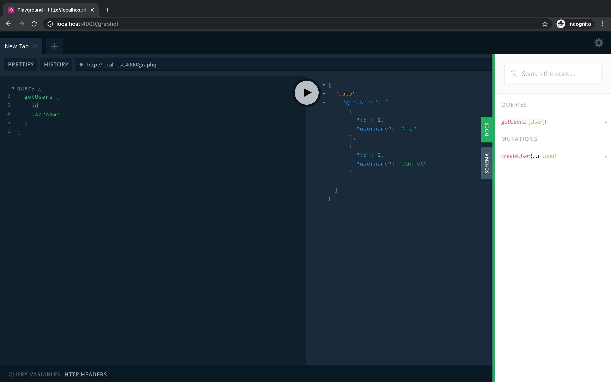

# GraphQL

GraphQL is a query language for APIs. Saruni utilizes spec-compliant GraphQL servers from [Apollo](https://www.apollographql.com/) to build production-ready, self-documenting GraphQL APIs.

Apollo is deployed to an AWS Lambda function as a stand-alone GraphQL server in production, but uses the popular [Express](https://expressjs.com/) Node.js application framework as a drop-in replacement behind the scenes to power local development.

## Schema

Every GraphQL server uses a schema to define the structure of data that clients can query. You can learn more about schema syntax [here](https://graphql.org/learn/schema/).

We can update schemas in Saruni applications at `api/src/graphql/typeDefs`.

```ts
import { gql } from "@saruni/api";

export const typeDefs = gql`
  type User {
    id: Int!
    username: String!
  }

  type Query {
    getUsers: [User]!
  }
`;
```

## Resolvers

Having defined the _structure_ of our data, we use resolvers to tell our Apollo Server how to fetch (with queries) or modify (with mutations) data associated with a particular type.

Resolvers are stored in the `api/src/graphql/resolvers` directory and use of the typed Prisma Client [we generate](/docs/backend/prisma) often makes for simple functions.

```ts
import { PrismaClient } from "@prisma/client";

export const db = new PrismaClient();

export const Query = {
  getUsers: async () => {
    return await db.user.findMany();
  }),
};
```

## Playground

GraphQL Playground is an interactive, in-browser GraphQL IDE, created by Prisma. After launching our development environment, we can find the Playground at `localhost:4000/graphql`. Without any extra work, we have an auto-updating documentation of our GraphQL API available in the right sidebar.


