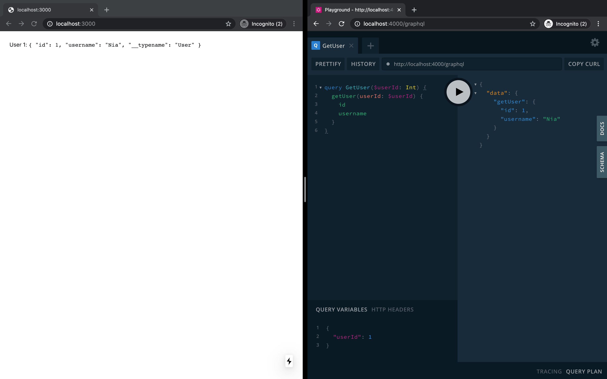

# GraphQL

When the time comes to fetch data from our GraphQL server we use the [query language](https://graphql.org/learn/queries/#operation-name) to describe our data requirements in a declarative way.

We add `*.graphql` files to the `web/src/graphql` directory to get started.

```graphql
query GetUser($userId: String) {
  getUser(userId: $userId) {
    id
    username
  }
}
```

In order to fetch, cache and modify application data we use [Apollo Client](https://www.apollographql.com/docs/react/). Saruni projects ship with this software already configured by wrapping the `App` component in `src/web/pages/_app.tsx` with `ApiProvider` from `@saruni/web`, so we can dive right in.

With our GraphQL server running on `localhost:4000`, we can use the `yarn saruni generate graphql` command to generate helpful hooks from the documents we create in `web/src/graphql`.

```tsx
import React from "react";

// Hook available through use of `saruni gen gql` command.
import { useGetUserQuery } from "../../generated";

const USER_ID = 1;

export default function Home() {
  const { data, loading } = useGetUserQuery({ variables: { userId: USER_ID } });
  if (loading) return <span>Loading...</span>;

  return (
    <React.Fragment>
      User {USER_ID}: <code>{JSON.stringify(data.getUser, null, 2)}</code>
    </React.Fragment>
  );
}
```


