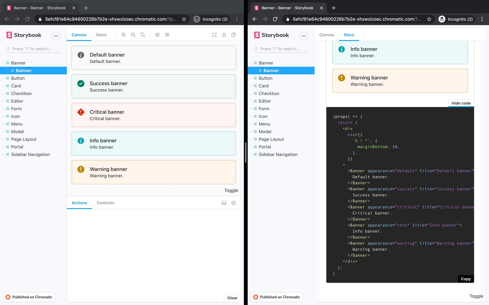

# Saruni UI

Saruni UI is a collection of reusable components that work seamlessly with Saruni projects, available under the `@saruni-ui/*` namespace on NPM. It includes common HTML elements like buttons and text inputs, as well as more sophisticated elements like modal dialogs that open the door to crafting sophisticated user interfaces.

## Storybook

The simplest way to get started with Saruni UI is to look at the published instance of Storybook—a tool that provides a sandbox to build UI components—[here](https://master--5efcf81e64c94600226b7b2e.chromatic.com/). Components are displayed in the Canvas tab, with the associated code available under the Docs tab.



## Installation

Saruni UI components can be added individually to the `web` package of Saruni projects to meet the needs of the application.

```bash
cd packages/web
yarn add @saruni-ui/button
```
