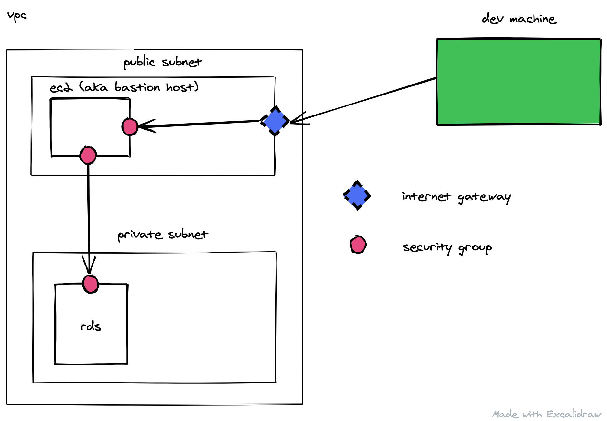
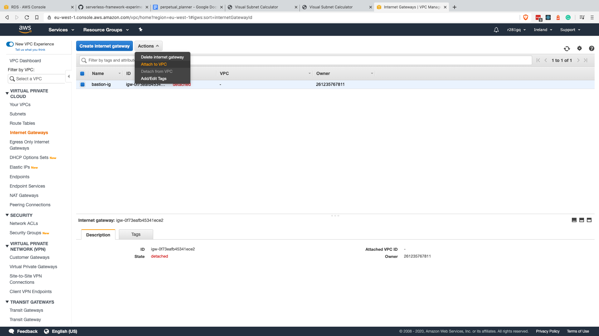
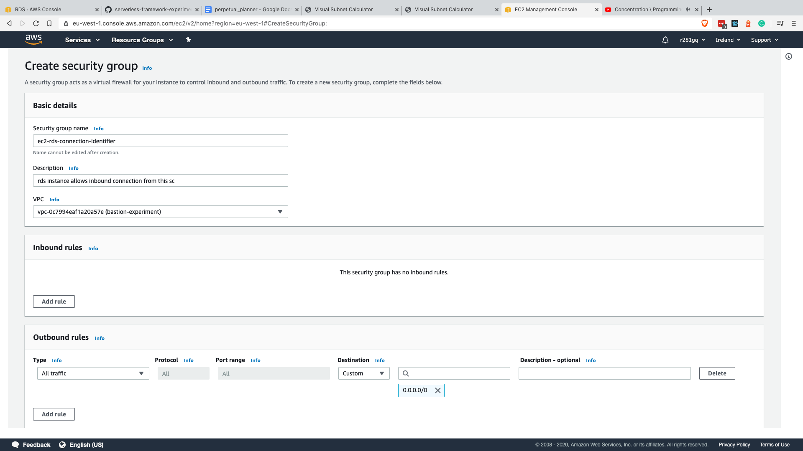

# Databases and AWS


There might be scenarios where you want to hide your database from the public. You don't want to expose a public endpoint for that. I think that is generally a good practice for production databases but we might have other reasons to do that.

This in itself is fine because most of the time there are other resources **inside** AWS that will interact with your DB. Like an EC2 virtual machine, a kubernetes resource or a Lambda. As they are inside AWS they don't need a public endpoint.

But what happens when we developers want to access the database. From our local mahcine. To check some data, to do some migration or roll back some migration.

How to do that?

# Bastion server

> A bastion host is a special-purpose computer on a network specifically designed and configured to withstand attacks. The computer generally hosts a single application, for example a proxy server, and all other services are removed or limited to reduce the threat to the computer. [Wikipedia](https://en.wikipedia.org/wiki/Bastion_host).

In plain english, that is just an *EC2* instance, accessible from the internet. It serves a single purpuse: **be able to ssh into our VM from a local instance.**

So in this guide we are going to build a bastion host with all the neccessary infrastructure so later we can communicate with a database that is **not** publicly accessable otherwise.



We have our VPC. Inside it we have a public and a private subnet. A public subnet has an Internet Gateway attached to it, so it can reach out to the internt. Our RDS instance will sit in a private subnet. No public access by default.

# Build time

Now we have our blueprint let's start building it. The very first thing is to create a VPC. That is where our rds will live. All other resources then must be placed inside a VPC if they wish to reach the DB.

## VPC

Creating a vpc is quite straithforward. What can be intimidating is the CIDR block.

I don't want to explain CIDR block here (also I'm the least quilified person for that). Not to mention, there are great resources out there that does that. 

[This video](https://www.youtube.com/watch?v=z07HTSzzp3o) is one of them. Please have a look at it because the rest of the article will rely on that.


Apart from the name the only thing needed to be provided is the CIDR block. Now if you have not watched the video above the tl;dr is this: put `20.0.0.0/16` there. It will give you plenty of IP adressed to work with.

## Subnets

Subnets are part of the VPC. So the above VPC with the CIDR block gave us 65,536 hosts (potential IP addresses). We can split them into subnets. Like from 0 to 255 will be assigned to subnet x. 256 - 300 will be to subnet y.

We need 3 private subnets and create a DB subnet group and put our RDS instance inside it. These three subnets will resembles subregions. So subnetA will be in region-a (eu-west-1-a) and so on.

If you followed the example you you can give `20.0.1.0/24` as the first CIDR block, `20.0.2.0/24` as the second, adn `20.0.3.0/24` as the third. That gives 255 ip address to each subnets groups. That is quite a lot of space to wotk with.


## DB subnet group

A database needs to sit in a subnet group. Subnet group must consist of multiple subnets.

With the newly created 3 subnets it is time to move to use them in a database subnet group.

That option can be found in the rds section.


## Create the database

We created the VPC and the subnets. Now we can place out database inside the private subnets. 

The database now lives inside a private subnet group. It does not have a public IP address so at this point there is now way of accessing it.


## Create another subnet

The next subnet we create will be a public one. Public means it will have an internet gateway in its routing table.

The creation process is exactly the same as with the previous ones.


## Create an Internet Gateway

THe internet gateway will allow us to intercept incoming traffic from the internet and reach the entities within a VPC.

Intenet Gateways can be created in the VPC section. No configuration is needed there.


After we have done with the creation we need to to attach it to our VPC.



## Create a unique route table for the public subnet

By default we get a routing table with our VPC. That routing table routes every traffic that matches the CIDR of our VPC inside to the VPC.

We create a new routing table and in there we add one additional route.


This second route with the destination `0.0.0.0/0` will catch every traffic that was unmathced by previous rules and forwards them to our target. Our target will be the Internet Gateway we just provided in the previous step. That will create a public subnet. A subnet that has an internet gateway.

As a last step we asssociate this routing table for our public subnet. That is the point where this subnet will become public.


It can be done in the subnet section by selecting the target subnet.

## Modify auto assign IP setting

Evertyhing inside the VPC and therefore in the subnet has a private ip.

But if we intend to access something inside a subnet it needs to have a public ip. Hitting that ip will reach the internet gateway and it will translate it to its private ip, so it will reach the right instance. THis will allow to have the public ip in the response from the instnace.


So in the subnet section, select the public subnet and modify the assign public ip section to allow it.

## Create the bastion host

The bastion host is just the most basic amazon image with one purpose: SSH.

Let's head to EC2 and launch an instance.


Select the image of `Amazon Linux Image ami-0ea3405d2d2522162 (64-bit x86)`.

In step 3, the configure instance details, select the VPC where we worked so far and the public subnet.

That should enable auto assigning the public ip.


In step 6 we have the option to create a new security group, a firewall entry of sort.

We can set up our instance to allow incoming SSH traffic (port 22) from MY Ip. That will track your IP, give to you by your ISP.


Before we would be able to launch we need to create a new private key (.pem) which will be used to authenticate ourselves in SSH connections. Create a new key pair, download it and launch the instance.


## Check the SSH connection

After we created the instance we can go back to see our EC2 instances.


If the instance state is running and the status checks are done we should be able to get into our machine using SSH.

Leaving that AWS window open we must need to go to the folder where we downloaded our private key (`.pem`) file.


If we list our files we can see we have permissions to write the key file. SSH does not like that. With the help of `chmod` command we can prevent writing that file.

```sh
chmod 400 bastion.pem
```


After this change we can start connecting via SSH to our EC2 instance (bastion host) with the following command:

```sh
ssh -i bastion.pem ec2-user@3.248.395.32
```

Of course, the name of the `.pem` file and the ip address will be different in your case.


If we see this picture that means we are in the instance.

# Connect the VM with RDS

We can connect to the EC2 instance sitting on AWS but still we have no idea how to connect to that RDS instance.


Let's have a look at this picture again. We can get into the EC2 instance. We are still in a public subnet. We want to get into the private one that hosts the database. According to this picture, the bastion host communicataes to the RDS with security groups.

In other words, the db will allow connections from a specific security group.

Security inbound (ingres) rules can allow traffic from an ip or from another security group. In this sense, security group identifies the resource.

## Create security groups

The first step therefore is to create a security group with no inbound rules.



The next step is to create a security group that will be attached to the db. In that secuiryt group there is an inbound rule.

We allow connection on port 5432 (postgres) from instances that has the identity security group (the sevurity group that created above).


## Attach the secrurity groups to db and VM

The identity sg needs to be attached to our bastion host (EC2 server). We already have one called SSH that is responsible for the SSH connection. In the action bar we can change the security groups.


We simply select to add another one so we will have two sg attached to our VM.

In RDS we just need to modify our db instance.


# Connect with DBWeaver

We already know that SSH works, we tried it. Know we need to use SSH to connect to the a database.

Next step is to fire up DBWeaver and try to connect to our db.


We gave these credentails that we gave to AWS during te db creation process. The endpoint can be found in the db dashboard.

Now comes the SSH part.


The host ip is the public ip of our EC2 instance. User in case of an amazon AMI instance is `ec2-user`. Select public key as an authentication method. Then select the key file from your hard drive.

If everything is set up correctly then we should see the follwing window after clicking on test connection.


# PSQL with SSH tunnel

We don't always want to connect to the database with a graphical interface.

We might want to do a migration and for that we need an open connection. With SSH tunnel we can do that.

In this case I'm just using `psql` to connect to the db with the help of an SSH tunnel.

We can create a tunnel with the SSH command with the -L prefix.

```bash
ssh -L 2222:database-1.c2avit44uwcq.eu-west-1.rds.amazonaws.com:5432 -i bastion.pem ec2-user@3.248.195.32
```

The above command means that `localhost:2222` should point to `database-1.c2avit44uwcq.eu-west-1.rds.amazonaws.com:5432`. That binds the remote port and host to `localhost` on port `2222`.

To estabslish the connection use bastion.pem private key and SSH into the machine that can be found at 3.248.195.32 with the user `ec2-user`. (IP will be different in your case).

Before running the SSH tunnel command, psql fails of course. It fails because there is nothing at `localhost:2222`


But after getting into the VM with SSH psql connects to our RDS instance that has no public ip.


That is how we can use a db locally with the help of a bastion host.
