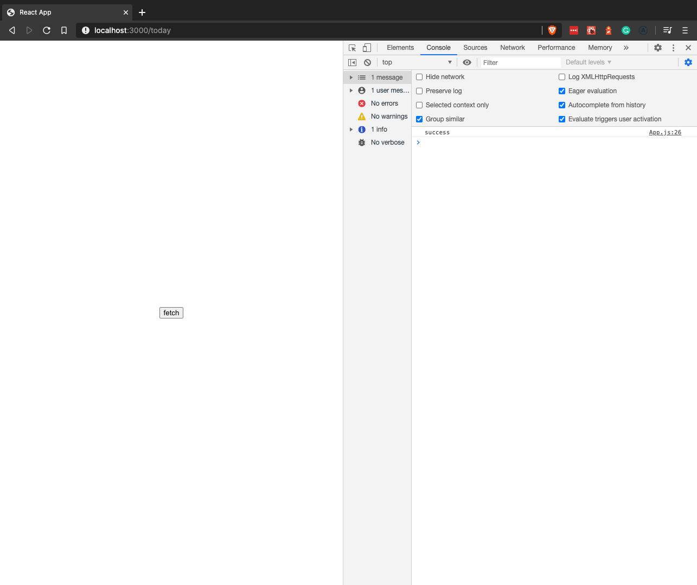
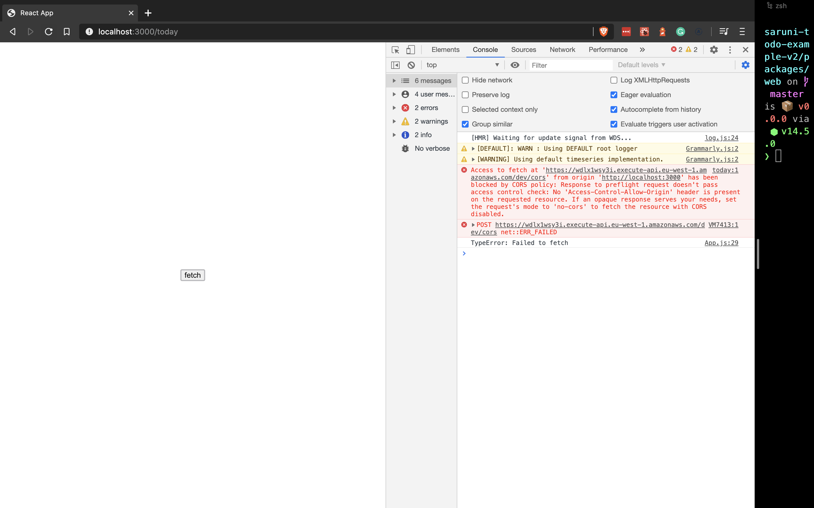
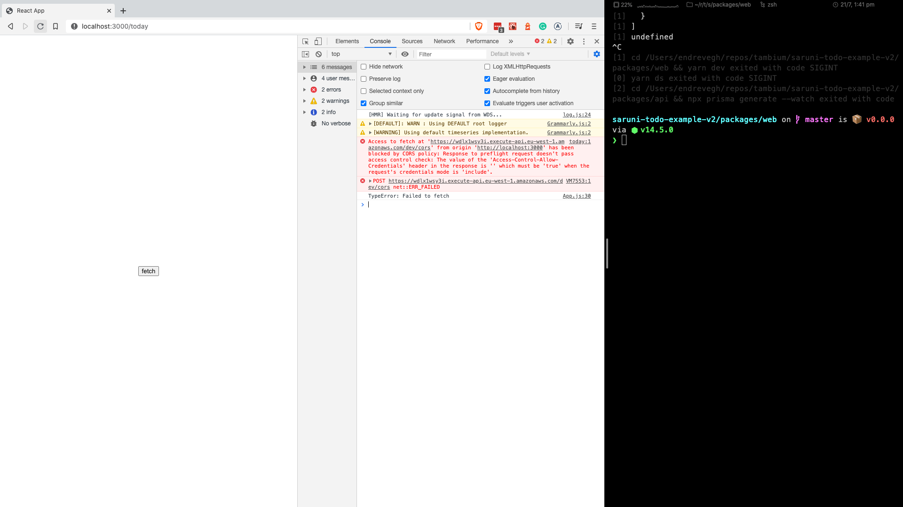
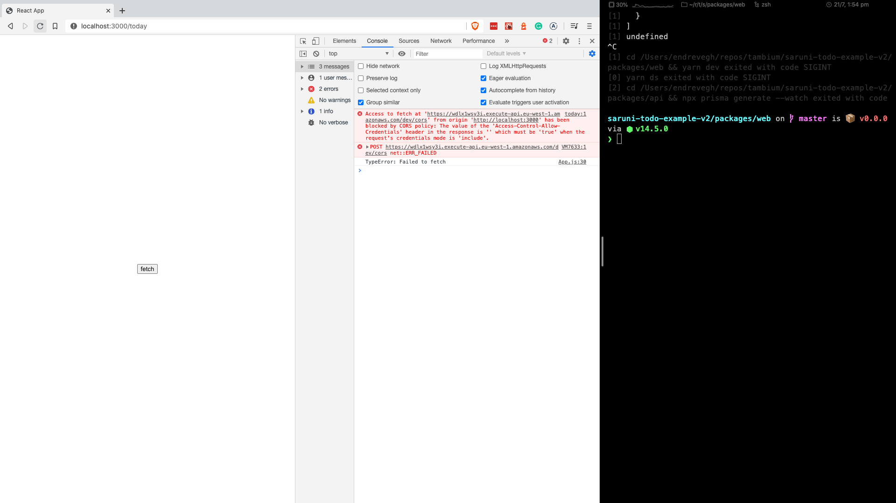

# intro

<!-- add link to the previous article where we discuss cors in raw form -->

We went through CORS and its remedies in the [last](/guides/cors) article. We used express servers and some static sites to demonstrate the problem of multiple origin API.

Now it is time to get into deployment. How serverless and particularly AWS lambda handles CORS.

The code for the backend side of this project can be found [here](https://github.com/tambium/GUIDE_RESOURCE_cors-sls).

As we cannot `cURL` (CORS is browser specific) we need a frontend. I use a simple cra app that can be found [here](https://github.com/tambium/GUIDE_RESOURCE_cors-sls-frontend). All the screenshots from the browser is taken using this app.

# the lambda function

The code for the handler is a really simple one. It will return a json with the content: `{ "ok": true }`. As the focus is on sls, AWS lambda and CORS I would like to keep the lambda code as simple as it can be.

```js
exports.handler = async () => {
  return {
    statusCode: 200,
    body: JSON.stringify({ ok: true }),
  };
};
```

# issue number one: non-complex (simple) requests

Non complex CORS request are the `GET`, `HEAD` and `POST` verbs with some simple headers. You can read more about what a non-complex CORS request is and what considered to be a "simple header" [here](https://developer.mozilla.org/en-US/docs/Web/HTTP/CORS#Examples_of_access_control_scenarios). They are the requests that **do not** trigger a preflight request.

To have any sort of CORS setup we must specify the `Access-Control-Allow-Origin` among the response headers.

```js
exports.handler = async () => {
  return {
    statusCode: 200,
    body: JSON.stringify({ ok: true }),
    headers: {
      "Access-Control-Allow-Origin": "*",
    },
  };
};
```

This is more than enough to satisfy our browser. Our app sitting at `http://localhost:3000` (a different domain) is able to make a get request.



# issue number two: complex request

Complex requests are the ones that trigger a preflight request. We are going to create a post request. In itself this is not a problem. `POST` is simple by default. But if we add for example, `content-type: application/json`, that request will become a complex one.

```js
fetch(
  URL,
  {
    method: "POST",
    headers: {
      "content-type: application/json"
    }
  }
)
```

The above fetch request is a complex request by CORS' standard. As such, it fails with our current setup.



So when we fire up that request we get an error. An error about the preflight request. That is expected since we did not do any preflight configuration. In sls, that is really easy.

```yml
functions:
  cors_test_lambda:
    handler: src/index.handler
    events:
      - http:
          path: /cors
          method: get
          cors: true
      - http:
          path: /cors
          method: post
          cors: true
```

All we need to do is to add `cors: true` to our events array in the yml file. That sets up the preflight request and creates OPTION request on aws. Everything is taken care for us.

# credentials

Now, if we want to send cookies and auth credentials across domains things will be a tiny bit more difficult but sls has us covered.

To make fetch grab our cookies and send it to another domain all we need to do is set `credentials` to `include` in our fetch call.

```js
fetch(
  URL,
  {
    method: "POST",
    headers: {
      "content-type": "application/json",
    },
    credentials: "include",
  }
)
```

Having made these changes our fetch fails again.



It first complains about the preflight request. In the [previous post](/guides/cors) we set the header `Access-Control-Allow-Credentials` to `true`. With sls we don't have to. We just need to tell sls to handle advanced CORS features and the preflight request will be modified accordingly.

```yml
functions:
  cors_test_lambda:
    handler: src/index.handler
    events:
      - http:
          path: /cors
          method: get
          cors: true
      - http:
          path: /cors
          method: post
          cors:
            allowCredentials: true
            headers:
              - Content-Type
            origin: "*"
```

In sls, CORS can be a boolean or an object. With this object based setup we have control over headers, origin and most importantly, credentials (this will attach `Access-Control-Allow-Credentials` to the preflight request).

If we deploy this, our error message changes to this:


This is a progress. Our error goes from the preflight request to the actual request. This happens because with include we cannot wildcard `origins` as a security precaution. We need to be specific about it and modify our lambda like this:

```js
exports.handler = async () => {
  return {
    statusCode: 200,
    body: JSON.stringify({ ok: true }),
    headers: {
      "Access-Control-Allow-Origin": "http://localhost:3000",
    },
  };
};
```

As a result we have a different error message. Again. `Access-Control-Allow-Credentials` is not set. We had this error before on the preflight request now we need to do that on the actual request.



```js
exports.handler = async () => {
  return {
    statusCode: 200,
    body: JSON.stringify({ ok: true }),
    headers: {
      "Access-Control-Allow-Origin": "http://localhost:3000",
      "Access-Control-Allow-Credentials": true
    },
  };
};
```

If we make those changes we finally have a success state. Our fetch request can communicate cookies between domains.

# extra bit - middy

Just as express has middlewares and among them one that is dedicated to setting the appropriate CORS headers AWS lambda has one: [middy](https://github.com/middyjs/middy). Let's use middy and quickly refactor our function.

We need to add two dependencies:

```sh
yarn add @middy/core @middy/http-cors
```

After these are installed we can refactor our lambda.

```js
const middy = require("@middy/core");
const cors = require("@middy/http-cors");

exports.handler = middy(async () => {
  return {
    statusCode: 200,
    body: JSON.stringify({ ok: true }),
  };
}).use(
  cors({
    origin: "http://localhost:3000",
    credentials: true,
  })
);
```

So middy works like this: the function `middy` takes a lambda function.

Middy is a higher order function that returns a chainable function. We can attach middlewares to it with the help of `.use()`. In the above case we add the CORS middleware. Notice we got rid of the CORS headers in the raw lambda. We only return the status code and body whereas in the previous steps we handled the CORS headers manually.

CORS is coming to the middleware. We just need to set the origin part and the credentials and the middleware will generate the appropriate headers for us.

The thing that it generates the headers is only half the picture. It is certainly handy that we don't need to deal with it. But the main advantage is that our lambda is **decoupled** from CORS totally. It is only concerned with the "business logic" whereas the CORS middleware only cares about, well the CORS stuff.

# verdict

In this series we went through a lot. We talked about what cors is and built some servers and frontends by ourselves to understand CORS and the core. Also checked out how Serverless and AWS Lambda is dealing with CORS related issues. We must be vigilant though. CORS can strike when it's least expected.