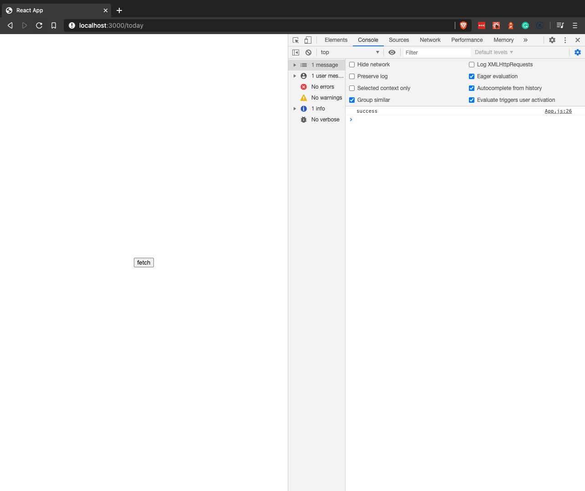
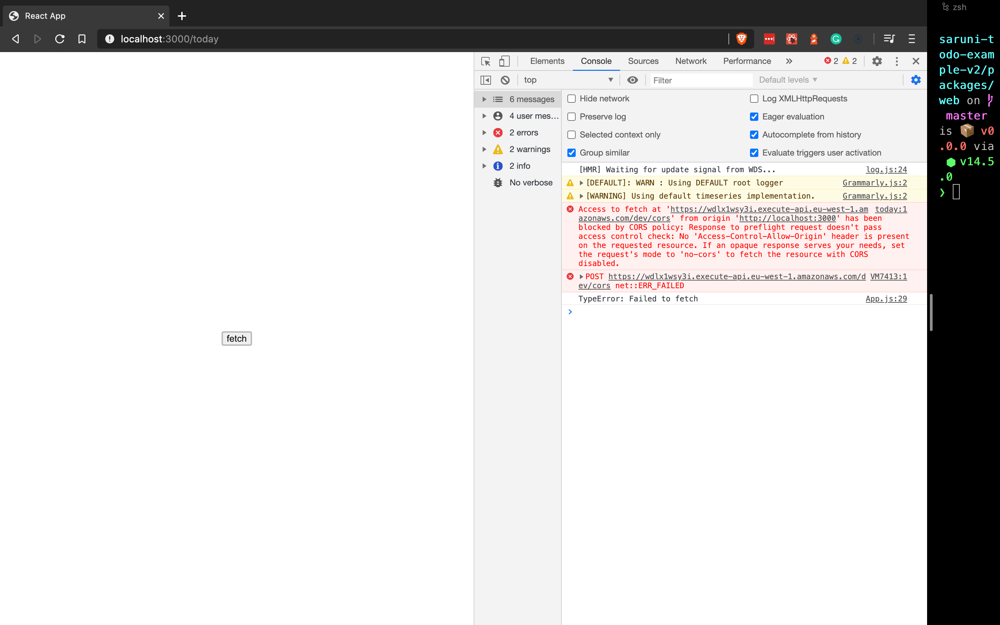
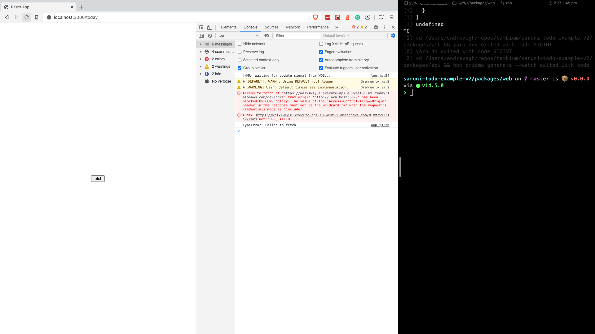
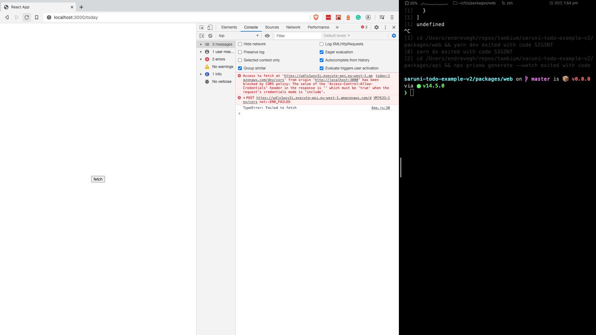

# CORS with AWS Lambda

In [the last guide](/guides/cors) we introduced CORS and its remedies in the context of an API called from multiple domains.

In this guide our focus shifts to CORS in a Serverless setting. Specifically, how [AWS Lambda](https://aws.amazon.com/lambda/) (the recommended deployment target for Saruni) handles CORS.

The code for the backend of this project can be found [here](https://github.com/tambium/GUIDE_RESOURCE_cors-sls). Since we can’t `cURL` (CORS is browser specific) we need a frontend. A simple `create-react-app` instance modelling our frontend can be found [here](https://github.com/tambium/GUIDE_RESOURCE_cors-sls-frontend).

## Lambda function

The code for the handler is simple. It will return JSON with the content: `{ "ok": true }`.

```js
exports.handler = async () => {
  return {
    statusCode: 200,
    body: JSON.stringify({ ok: true }),
  };
};
```

## Handling simple requests

We outlined the concept of simple requests in the last guide. To recap, these are requests that do not generate preflight requests. Usually that’s through use `GET`, `HEAD` or `POST` methods without sophisticated headers.

As before, we must specify `Access-Control-Allow-Origin` among the response headers.

```js
exports.handler = async () => {
  return {
    statusCode: 200,
    body: JSON.stringify({ ok: true }),
    headers: {
      "Access-Control-Allow-Origin": "*",
    },
  };
};
```

This is enough to satisfy CORS constraints. Our web app on `http://localhost:3000` (a different domain) is able to make a `GET` request.



## Handling complex requests

Complex requests are those that trigger a preflight request. We’ll use a `POST` request with a `content-type` of `application/json`, which qualifies.

```js
fetch(
  URL,
  {
    method: "POST",
    headers: {
      "content-type: application/json"
    }
  }
)
```

Without suitable configuration, we see the familiar CORS preflight error.



Resolving this error in a Serverless context is simple. All we do is add the `cors: true` option to our events array in the `serverless.yml` configuration file, which sets up the preflight request and creates an OPTION request on AWS.

```yml
functions:
  cors_test_lambda:
    handler: src/index.handler
    events:
      - http:
          path: /cors
          method: get
          cors: true
      - http:
          path: /cors
          method: post
          cors: true
```

## Handling credentials

If we want to send cookies and auth credentials across domains, Serverless has us covered.

For fetch to grab our cookies and send them to another domain, all we need to do is set `credentials` to `include` in our fetch call.

```js
fetch(URL, {
  method: "POST",
  headers: {
    "content-type": "application/json",
  },
  credentials: "include",
});
```

Having made these changes our fetch fails again.


We receive an error about the preflight request. In the [previous guide](/guides/cors) we resolved this issue by setting the header `Access-Control-Allow-Credentials` to `true`. With Serverless, we don't have to. Instead, we tell Serverless to handle advanced CORS features and the preflight request will be modified accordingly.

```yml
functions:
  cors_test_lambda:
    handler: src/index.handler
    events:
      - http:
          path: /cors
          method: get
          cors: true
      - http:
          path: /cors
          method: post
          cors:
            allowCredentials: true
            headers:
              - Content-Type
            origin: "*"
```

In Serverless, CORS options can be a boolean or an object. Using an object means we have control over headers, origin and most importantly, credentials (which will attach `Access-Control-Allow-Credentials` to the preflight request).

With these changes deployed, our error message changes:



Our error now relates to the actual request rather than the preflight request. This happens because we cannot wildcard `origins` as a security precaution. We need to be specific, so we modify our Lambda accordingly.

```js
exports.handler = async () => {
  return {
    statusCode: 200,
    body: JSON.stringify({ ok: true }),
    headers: {
      "Access-Control-Allow-Origin": "http://localhost:3000",
    },
  };
};
```

Our final error relates to `Access-Control-Allow-Credentials` header not being set. We dealt with this error on the preflight request and now we need to handle the actual request.



After making the changes we reach a success state where our fetch request can communicate cookies between domains.

```js
exports.handler = async () => {
  return {
    statusCode: 200,
    body: JSON.stringify({ ok: true }),
    headers: {
      "Access-Control-Allow-Origin": "http://localhost:3000",
      "Access-Control-Allow-Credentials": true,
    },
  };
};
```

### Extension: middy middleware

Just as Express has middleware convenience functions—among them being one dedicated to setting appropriate CORS headers—AWS lambda has middleware packages too: including [middy](https://github.com/middyjs/middy). We’ll use middy to refactor our function.

We start by adding two dependencies.

```sh
yarn add @middy/core @middy/http-cors
```

With these packages installed, we can refactor our Lambda.

```js
const middy = require("@middy/core");
const cors = require("@middy/http-cors");

exports.handler = middy(async () => {
  return {
    statusCode: 200,
    body: JSON.stringify({ ok: true }),
  };
}).use(
  cors({
    origin: "http://localhost:3000",
    credentials: true,
  })
);
```

The function `middy` takes a Lambda function.

Middy is a higher order function that returns a chainable function. We can attach middlewares to it with the help of `.use()`. In the code above we added CORS middleware. Notice we got rid of the CORS headers in the raw Lambda. We only return the status code and body where previously we had to handle the CORS headers manually.

CORS is resolved by the middleware. We just set the origin and the credentials and the middleware will generate the appropriate headers for us.

Generation of headers is only half the picture. The main advantage is that our Lambda is decoupled from CORS totally. It is only concerned with the business logic, whilst the CORS middleware focuses on&hellip; well, CORS.

## Conclusion

Over the course of two guides we walked through what CORS is, built servers and web apps to understand CORS in action. We also checked out how Serverless and AWS Lambda handles CORS related issues. We hope this was helpful. Good luck!
