import { BasicCorsError, SameDomain } from "./images";

# CORS

Building full-stack web applications means connecting a frontend (where users interact) with an API (where data is retrieved).

Things may seem okay when developing those parts independently, but when brought together we may face errors relating to CORS. In this guide and [another](/guides/cors-aws-lambda), we’ll look at how to avoid common pitfalls—first learning about CORS generally, and then applied in the context of a Serverless environment on AWS Lambda as recommended for Saruni.

## What is CORS?

CORS (Cross-Origin Resource Sharing) is a safety feature in browsers that gives developers control over which resources can be shared or manipulated from other domains. This is achieved by setting CORS policies on the server-side and tweaking fetch requests.

Since CORS is for browsers and the AJAX (Fetch) API, server-side processes like `cURL` requests or use of the Node.js HTTP library (or some abstraction over it) are unaffected.

## Why do we need CORS?

CORS is all about security.

Imagine a world where `DOMAIN_A` wants to access—or even modify—a resource on `DOMAIN_B`: for example, updating a user profile. If `DOMAIN_A` is a trusted client of `DOMAIN_B` that may be okay, but the opt-in nature of CORS prevents a scenario where an untrusted client is also able to update that resource.

# CORS in practice

In the following example, a web app invokes a fetch request for a resource. Since the web app and the REST API serving the resource are on the same domain (`DOMAIN_A` or, say `https://example-app.com`) there are no problems with CORS.

<SameDomain />

## First line of defence

In the next example we face a problem. Now, a second client sits on a different domain
(`DOMAIN_B`). With no configuration, attempts to request a resource will return a CORS error of the form:

> Access to fetch at `https://DOMAIN_A/resource` from origin `https://DOMAIN_B` has been blocked by CORS policy: No `Access-Control-Allow-Origin` header is present on the requested resource.

<BasicCorsError />

## Code sample

The example above shows the first line of defence from CORS. To see it in practice and explore resolutions, let’s create our own `DOMAIN_A` and `DOMAIN_B`.

The completed code shared below can be found in [this Git repository](https://github.com/tambium/GUIDE_RESOURCE_cors-raw).

### Basic setup

We’ll use plain HTML and a sprinkling of JavaScript for the web apps and Node.js through [Express](https://expressjs.com/) for the server.

We start by creating two servers: one serving on port `4000` and the other on port `3000`. Port `4000` is home to a REST API (serving a single resource) and one of the frontend web apps. Port `3000` serves a different frontend web app, with no REST API.

```ts
import express from "express";

const resource = {
  username: "Saruni",
};

const DOMAIN_A = express();

// Serves contents of `public` directory (HTML, JavaScript)
// to `localhost:PORT/web-app`.
DOMAIN_A.use("/web-app", express.static("public"));

DOMAIN_A.get("/resource", (_, response) => {
  response.status(200).send({ resource });
});

DOMAIN_A.listen(4000, () => {
  console.log("DOMAIN_A is available on port 4000...");
});

const DOMAIN_B = express();

DOMAIN_B.use("/web-app", express.static("public"));

DOMAIN_B.listen(3000, async () => {
  console.log("DOMAIN_B is available on port 3000...");
});
```

Our frontend displays an HTML `<button>` that reaches out to the server on port `4000`.

```html
<html>
  <body>
    <div>
      <button onclick="get()">Fetch resource</button>
    </div>
    <script src="main.js"></script>
  </body>
</html>
```

```js
const apiEndpoint = "http://localhost:4000/resource";

const get = async () => {
  const result = await fetch(apiEndpoint);
  console.log(await result.json());
};
```

After firing up our [basic setup](https://github.com/tambium/GUIDE_RESOURCE_cors-raw) with `yarn dev` we find our two web apps at `localhost:4000/web-app/` and `localhost:3000/web-app/`.

As expected, when we request the resource by clicking the button the client served on the same domain as the REST API retrieves the response from the server successfully.

The client served on a different domain to the REST API is blocked by CORS. This is the first line of defence from CORS in practice.

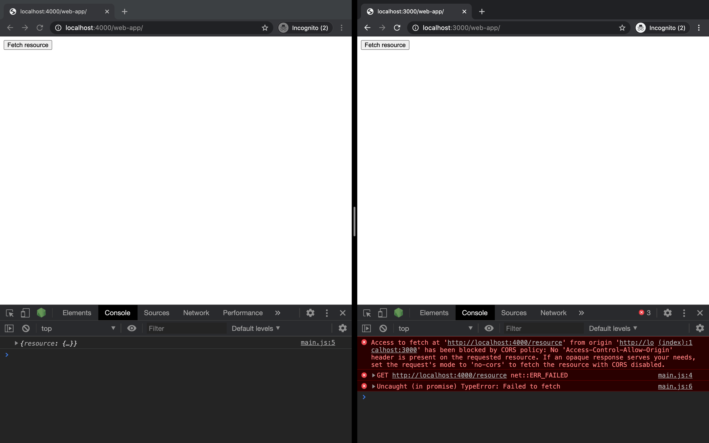

## Resolving access control

The error makes clear that the problem relates to a lack of `Access-Control-Allow-Origin` headers on the requested resource.

We can confirm this is the case in the Network tab of Developer Tools under the Response Headers.

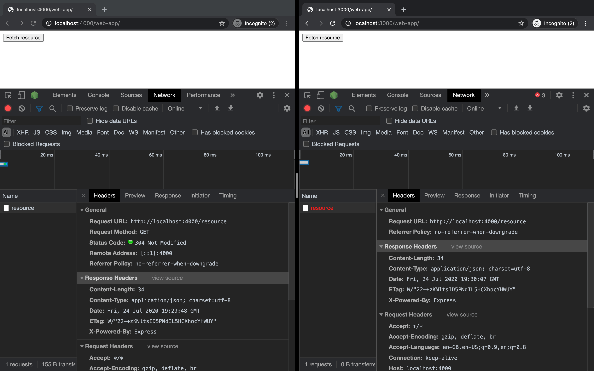

To resolve this CORS error, we add the `Access-Control-Allow-Origin` header to the response on the server.

```js
DOMAIN_A.get("/resource", (_, response) => {
  response
    .header("Access-Control-Allow-Origin", "http://localhost:3000")
    .status(200)
    .send({ resource });
});
```

When we check back on the web app instance that was facing issues with CORS before, the error is resolved. Our resource is served successfully after configuring the access control headers on the server.

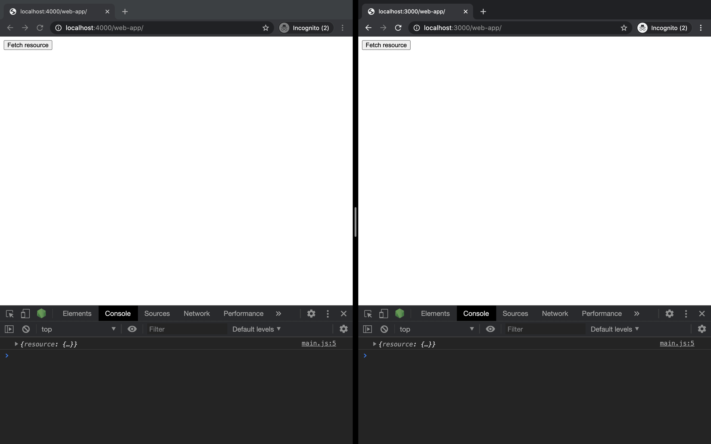

When we check the Network tab, we find the `Access-Control-Allow-Origin` header among the response headers.

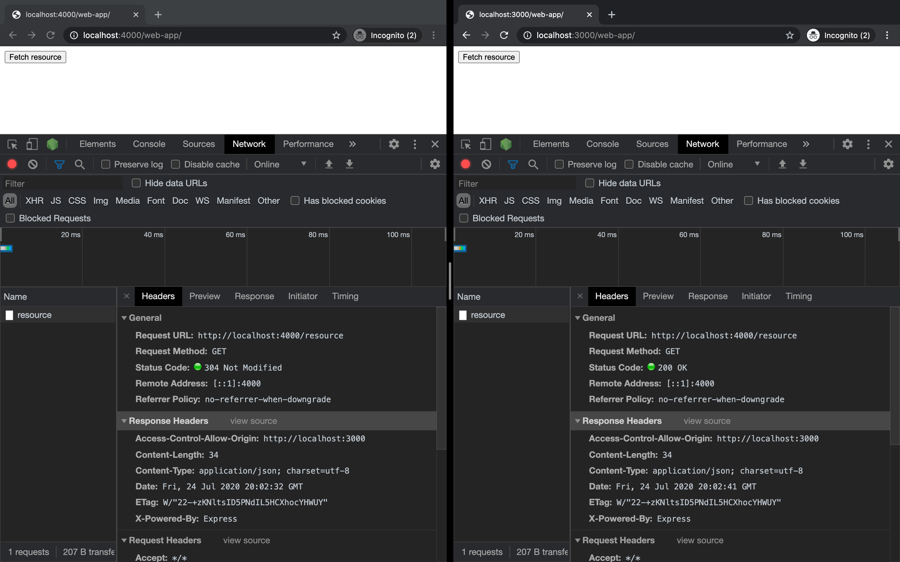

### Bonus: wildcard origin

Despite allowing access to the resource from `http://localhost:3000`, requests from other domains would still receive CORS errors.

Should we wish to allow requests from every domain, we can use the wildcard selector on the server when defining our headers.

```js
DOMAIN_A.get("/resource", (_, response) => {
  response
    .header("Access-Control-Allow-Origin", "*")
    .status(200)
    .send({ resource });
});
```

# second line of defense

In terms of CORS there are simple requests and not so simple request. Instead of me trying to explain what singe requests are in the context of CORS, I will just copy it from MDN (find the full article [here](https://developer.mozilla.org/en-US/docs/Web/HTTP/CORS).

One of the allowed methods:

- GET
- HEAD
- POST

Apart from the headers automatically set by the user agent (for example, Connection, User-Agent, or the other headers defined in the Fetch spec as a “forbidden header name”), the only headers which are allowed to be manually set are those which the Fetch spec defines as a "CORS safe listed request-header", which are:

- Accept
- Accept-Language
- Content-Language
- Content-Type (but note the additional requirements below)
- DPR
- Downlink
- Save-Data
- Viewport-Width
- Width

The only allowed values for the Content-Type header are:

- application/x-www-form-urlencoded
- multipart/form-data
- text/plain

No event listeners are registered on any XMLHttpRequestUpload object used in the request; these are accessed using the XMLHttpRequest.upload property.

No ReadableStream object is used in the request.

If you want the tl;dr

Some requests don’t trigger a CORS preflight request. Those are called “simple requests”. The rest does trigger a preflight request (more on preflight requests just in a bit). They are complex.

Mainly that means a request is simple if:

- it is either GET, POST or HEAD
- does not have fancy header

## create a post resource

Let's move carefully from the simple request to the not that simple. On the web apps I added a second button that invokes this function.

```ts
const post = async () => {
  const result = await fetch(apiEndpoint, {
    method: "POST",
  });

  console.log(await result.json());
};
```

In the server I added a new method for the the `/resource` resource.

```js
sameOriginApp.post("/resource", (_, response) => {
  response
    .header("Access-Control-Allow-Origin", "*")
    .status(200)
    .send({ resource });
});
```

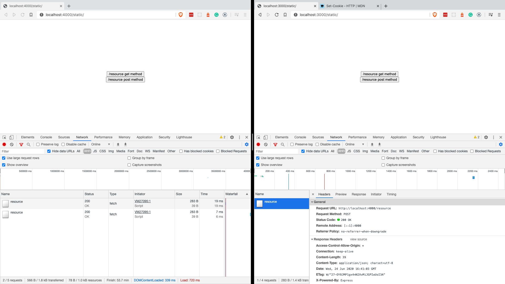

Nothing new here. POST in itself is a simple request, so with the `Access-Control-Allow-Origin` header we are good to go.

But with a POST request we usually want to do more then we would do with a GET request. Sending data and hopefully do some mutation in the backend.

For that we need to do modification in the fetch request.

```js
const post = async () => {
  const result = await fetch(apiEndpoint, {
    method: "POST",
    headers: {
      "Content-Type": "application/json",
    },
    body: JSON.stringify({ field: "change" }),
  });

  console.log(await result.json());
};
```

To process json we need to set header `content-type` to `application/json`. Problem is, that pushes our request from being a simple to being a complex one.

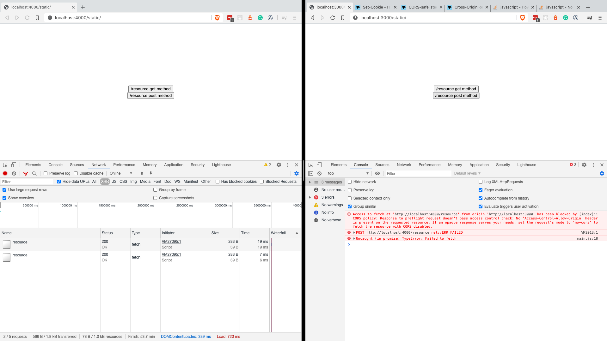

The browser is no complaining about preflight request.

## preflight request

If our request is not a simple one (i.e. it is not GET, HEAD, POST and / or it has fancy headers) then the browser makes a preflight request to the server before the actual one.

It is sort of calling the cinema if they have tickets before getting into the car, instead of just showing up there.

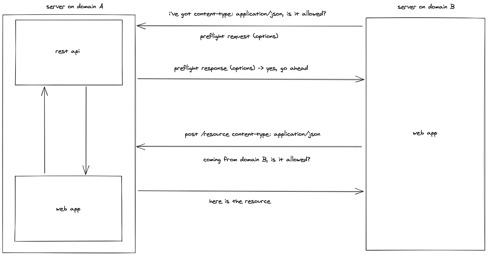

Preflight requests gives information about the header and the method. Is Content-type allowed? Is DELETE HTTP verb fine?

In the preflight **request** we can see the browser sends two headers:

- Access-Control-Request-Headers: content type
- Access-Control-Request-Method: post

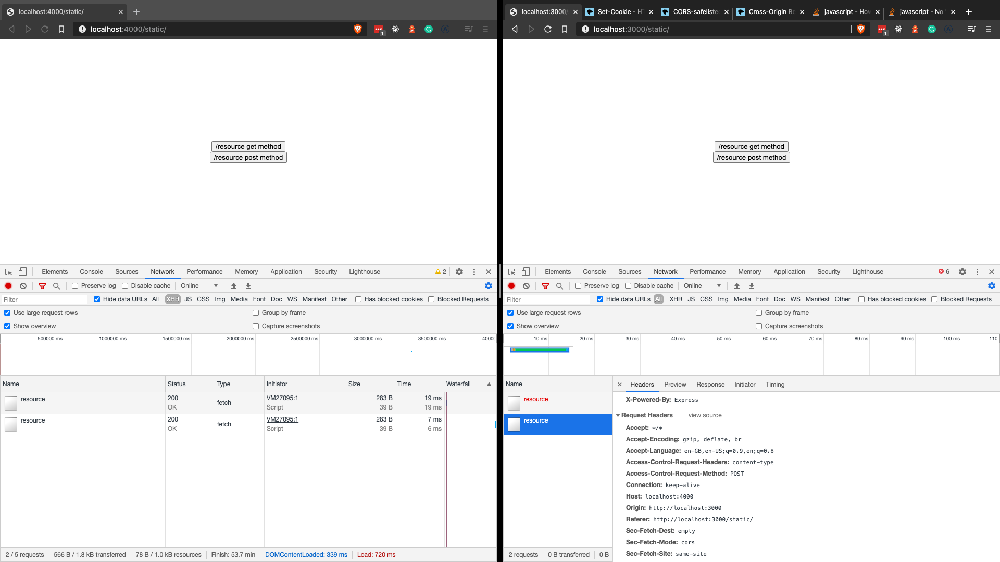

That is asking: the method will be a POST with `content-type` headers. Good to go?

To have an answer from the server we need to create an `OPTION` verb that will say: yes!

```js
sameOriginApp.options("/resource", (_, response) => {
  response.set("Access-Control-Allow-Origin", "*");
  response.set("Access-Control-Allow-Methods", "POST, OPTIONS");
  response.set("Access-Control-Allow-Headers", "Content-Type");

  response.sendStatus(200);
});
```

This method just answers the preflight request. In the browser we can see that the response headers are set accordingly.

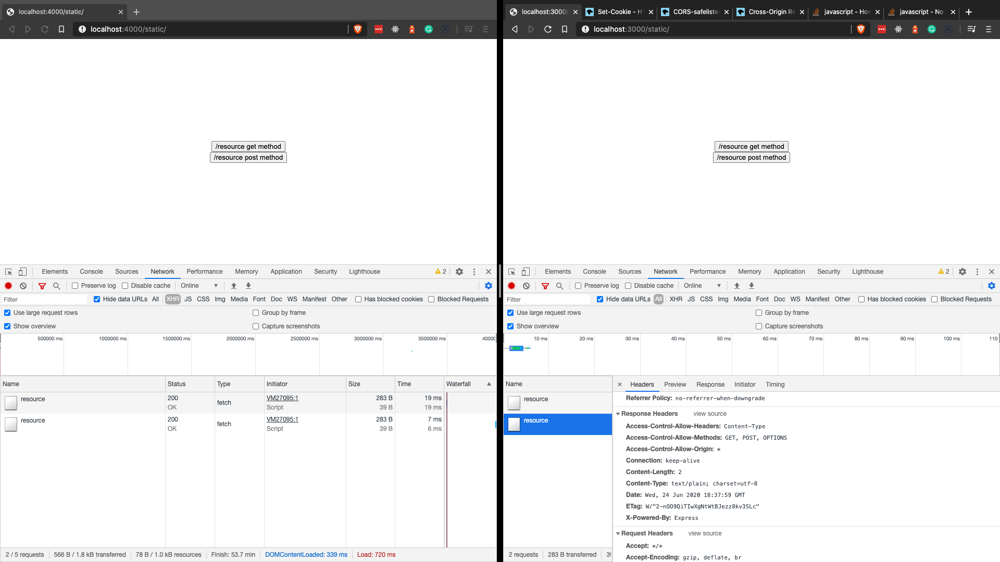

Note: the origin header is still present in the POST handler.

One more step. Since we know the type is json we can parse the body and mutate our "db".

```js
sameOriginApp.post("/resource", bodyParser.json(), (request, response) => {
  response.set("Access-Control-Allow-Origin", "*");

  resource.field = request.body.field;

  response.send({ resource });
});
```

That is all about preflight requests. They are sent by the browser to get some information from the server before sending the real one.

# credentials

The third line of defense adds more complication on the top of what we learnt.

Let's consider this scenario. We have the `/resource` resource. We want to have another one called `/protected_resource`. It will require a cookie called auth. Otherwise you can't access the resource.

```js
import cookieParser from "cookie-parser";

// to parse the cookies on th request object
sameOriginApp.use(cookieParser());

// the route
sameOriginApp.get("/protected_resource", (request, response) => {
  if (!request.cookies.auth) {
    return response.sendStatus(401);
  }

  response.json({ protected: "top secret" }).sendStatus(200);
});
```

Calling the endpoint will give us a big `401` because we don't have a cookie.

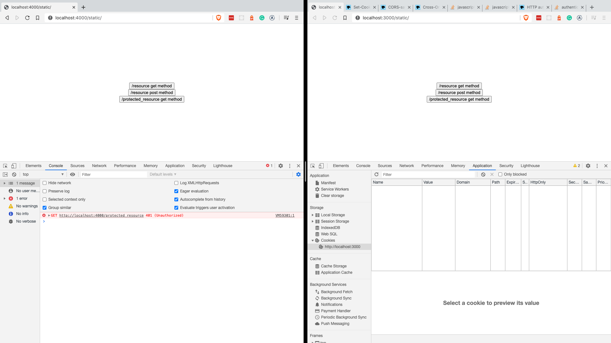

## set an http cookie

It could not have passed our authentication since we don't have any cookie. The way to do that is another route in our express API that will return a `Set-Cookie` header.

```ts
sameOriginApp.post("/auth", (_, response) => {
  response
    .cookie("auth", "authHeaderContent", { httpOnly: true })
    .sendStatus(204);
});
```

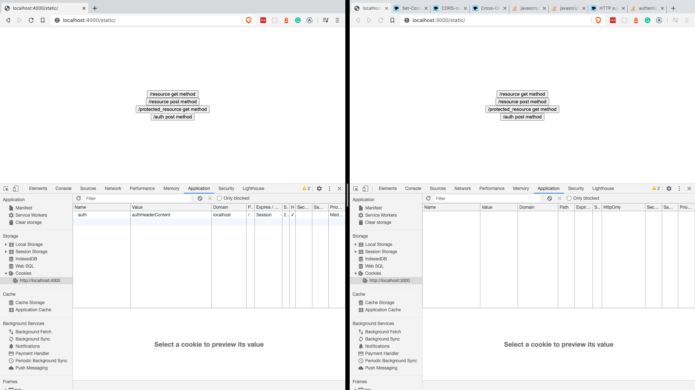

Clicking on the newly added `<button />` (you can check the frontend, but its just another fetch request) we should be able to reach out to the rest API.

Here is our cookie. Now we should be able to retrieve our protected resource.

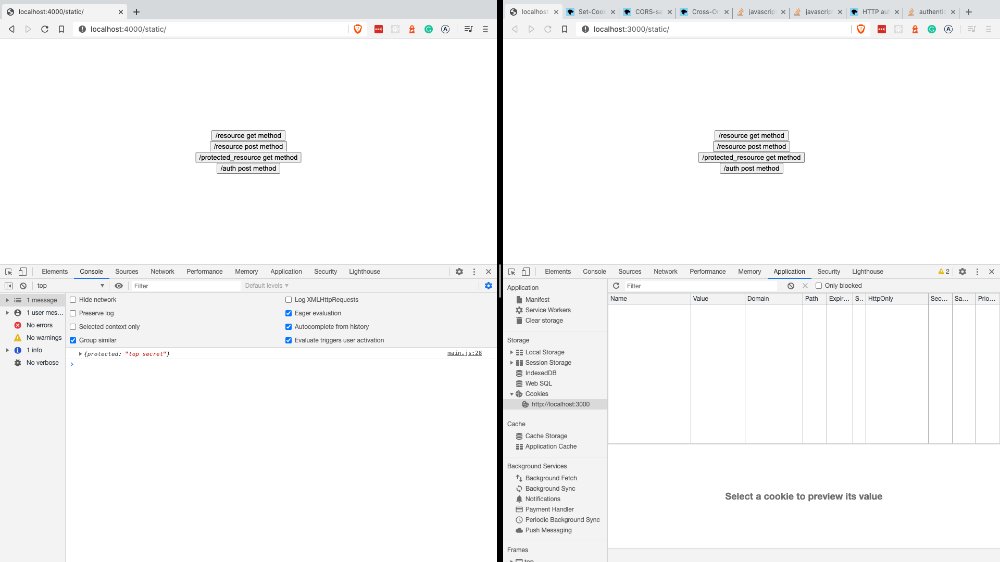

And here it is. With the help of the cookie we were able to reach to the API.

## cors

We made it work with the same domain app. Comes the harder part. CORS.

Clear the cookie and see what is happening.

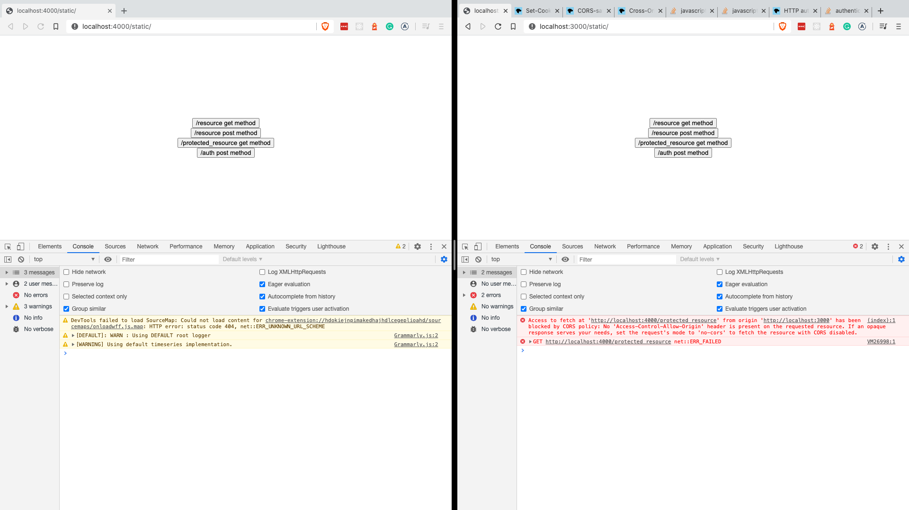

The very first issue is the basics of cors. `/protected_resource` is a GET method without headers -> simple cors request.

All we need is the `Allow-Control-Origin-Header`.

```js
sameOriginApp.get("/protected_resource", (request, response) => {
  response.set("Access-Control-Allow-Origin", "*");

  if (!request.cookies.auth) {
    return response.sendStatus(401);
  }

  response.json({ protected: "top secret" }).sendStatus(200);
});
```

There is nothing new here. Just adding the header as we did in the beginning of this article.

Now we removed CORS error for a `401`. But that is fine, we did not have any cookie.

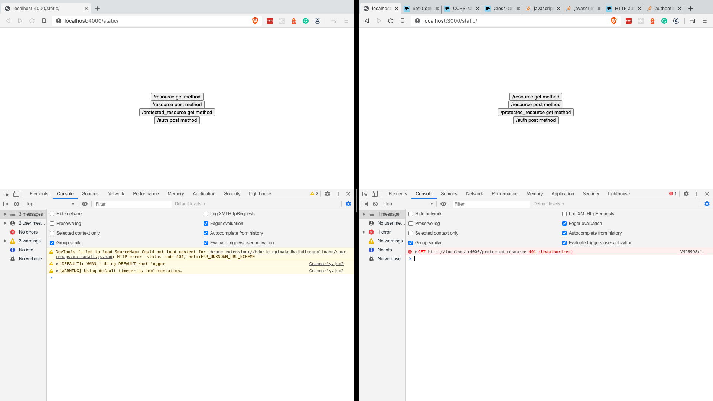

Let's try to get one.

## auth

The way to get a cookie is to reach the `/auth` endpoint.

Hitting the `/auth` endpoint gets us back the same CORS error. Let's put the origin header there as well.

```js
sameOriginApp.post("/auth", (_, response) => {
  response.set("Access-Control-Allow-Origin", "*");

  response
    .cookie("auth", "authHeaderContent", { httpOnly: true })
    .sendStatus(204);
});
```

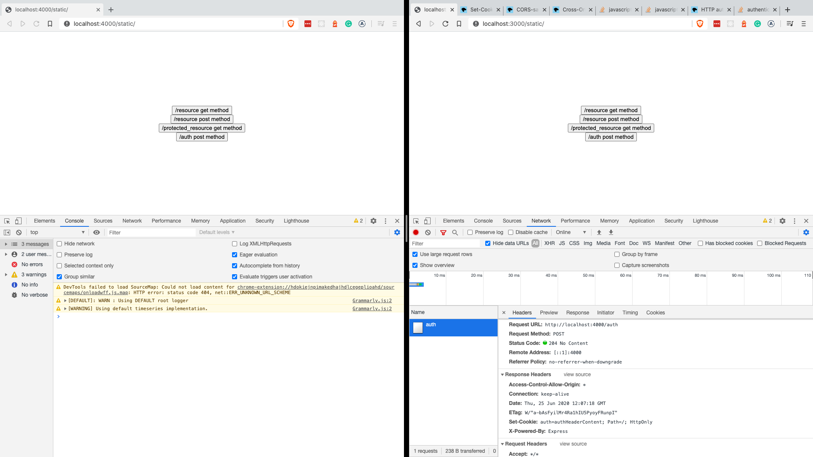

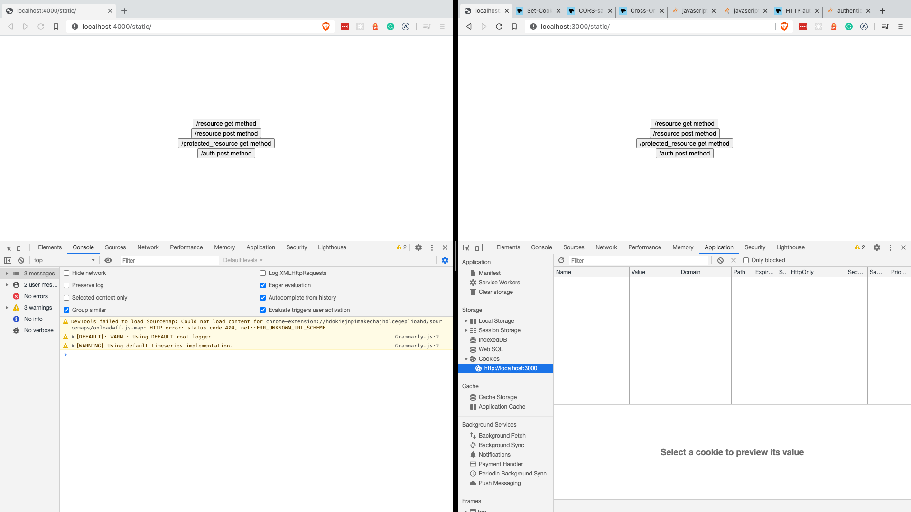

Strange thing! No CORS errors, the `Set-Cookie` header is in the response, yet there is no cookie present in the applications tab.

## credentials

We need to explicitly request credentials (like cookies) to be communicated by the fetch request. How? By adding the credentials `include` field.

```js
const set_header = async () => {
  try {
    const result = await fetch(setHeaderEndpoint, {
      method: "POST",
      credentials: "include",
    });

    console.log(await result.json());
  } catch {}
};
```


Something is just not right. We received a new kind of CORS error: wildcards are not permitted while using credentials.

First rule: when credentials are communicated between different domains (credentials set to `include`) we can't get away with the `"*"` in the `Access-Control-Allow-Origin` header. We need to be specific since with potential authentication there is much more security concerns.

Let us be more specific. Replace `"*"` with `http://localhost:3000`.

```ts
sameOriginApp.post("/auth", (_, response) => {
  response.set("Access-Control-Allow-Origin", "http://localhost:3000");

  response
    .cookie("auth", "authHeaderContent", { httpOnly: true })
    .sendStatus(204);
});]
```


Everyone is happy now? Nope. turns out allowing credentials to move freely between domains we don't just need to request it by fetch (setting `credentials` to `true`) but we actually need to enable it on the server. (Remember: CORS is set up on the server. Fetch request things and the server may or may not comply) This needs to be done in a similar way we enabled all other CORS related setting: with headers.

The header for that is called `Access-Control-Allow-Credentials`.

Lets set it to `true`.

```ts
sameOriginApp.post("/auth", (_, response) => {
  response.set("Access-Control-Allow-Origin", "http://localhost:3000");
  response.set("Access-Control-Allow-Credentials", "true");

  response
    .cookie("auth", "authHeaderContent", { httpOnly: true })
    .sendStatus(204);
});
```

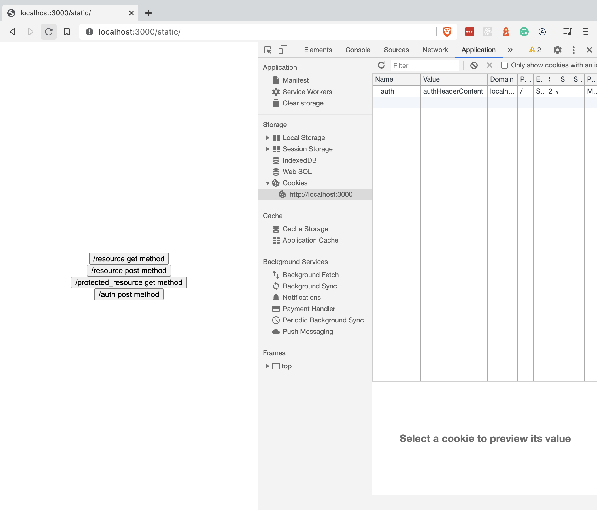

Boom! the cookie is there. First job is done. Lets start using it.

## hitting the protected route

Unfortunately we hit an unathorized error despite having the cookie. The reason for thatannoying problem is fetch: we have not defined credentials include.

Reminder: the `include` in the previous section was to **retrieve** the cookie from a different domain. We retrieved it. Now we need to **send it back** to the `/protected_route` endpoint. Again, different domain, so we need to set `credentials`: `include`.

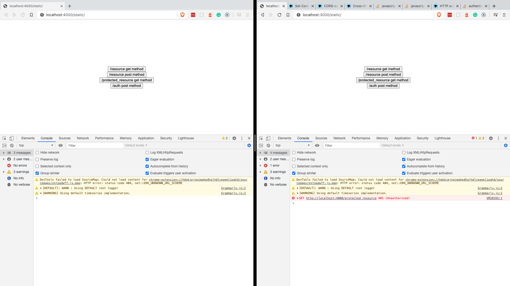

```js
const protected_get = async () => {
  try {
    const result = await fetch(protectedResourceEndpoint, {
      method: "GET",
      credentials: "include",
    });

    console.log(await result.json());
  } catch {}
};
```

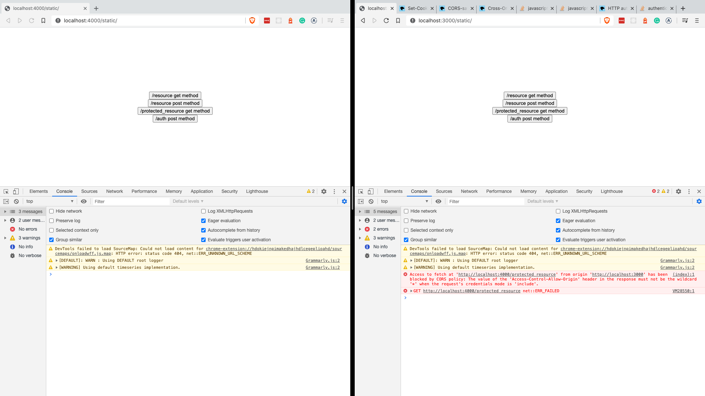

We are better now. We are at the same problem we had encountered with the `/auth` route.

That is the wildcard issue.

```ts
sameOriginApp.get("/protected_resource", (request, response) => {
  response.set("Access-Control-Allow-Origin", "http://localhost:3000");

  if (!request.cookies.auth) {
    return response.sendStatus(401);
  }

  response.json({ protected: "top secret" }).sendStatus(200);
});
```

The wildcard issue is gone now.


But now we are facing the missing `Access-Control-Allow-Credentials` on the `/protected_route`. By this time we are experts at setting CORS headers.

```ts
sameOriginApp.get("/protected_resource", (request, response) => {
  response.set("Access-Control-Allow-Credentials", "true");
  response.set("Access-Control-Allow-Origin", "http://localhost:3000");

  if (!request.cookies.auth) {
    return response.sendStatus(401);
  }

  response.json({ protected: "top secret" }).sendStatus(200);
});
```

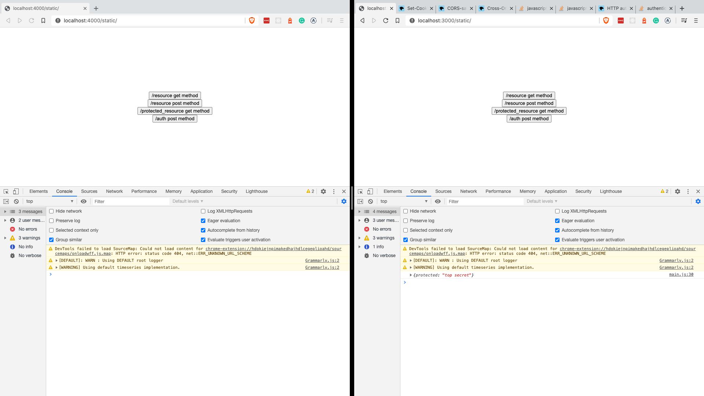

Whoooa, finally we are here. The `/protected_resource` is in our hands! Even CORS couldn't get in our way.

Hopefully we demystified what CORS is, why it exists and how to tame it. In the [following article](/guides/cors-aws-lambda) we'll see how to set up CORS with AWS Lambda and the Serverless framework.
