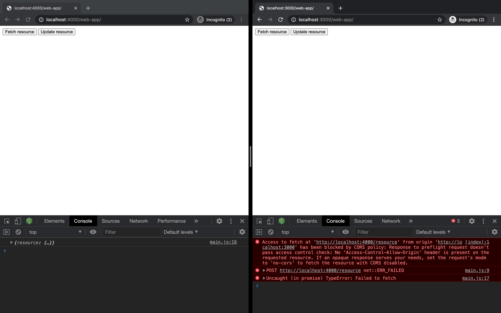
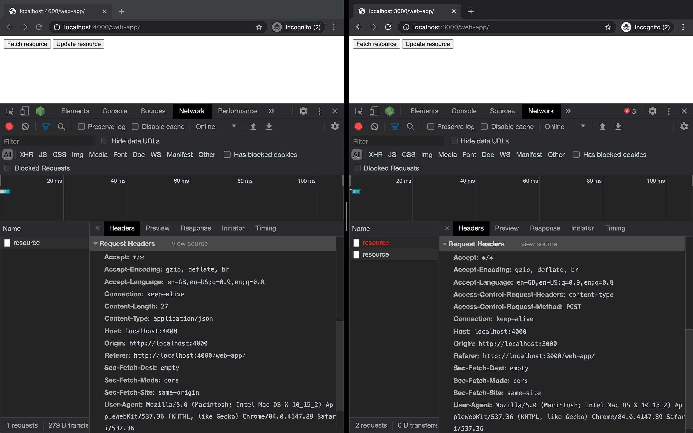
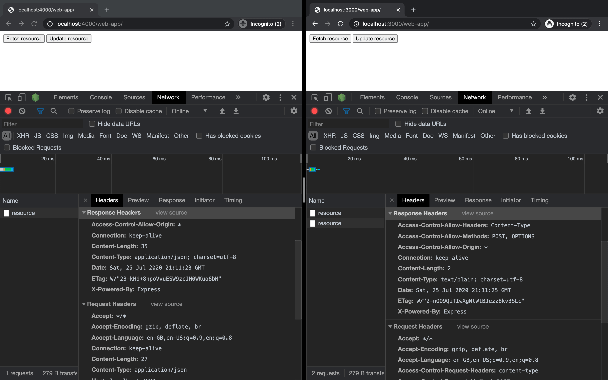
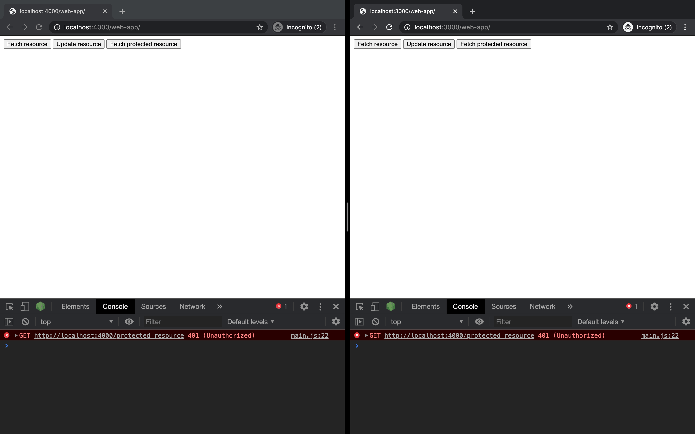
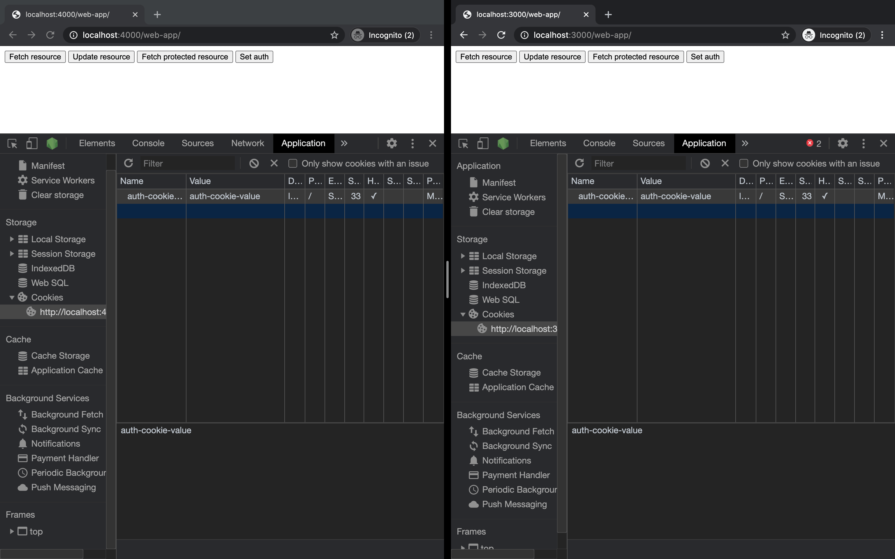
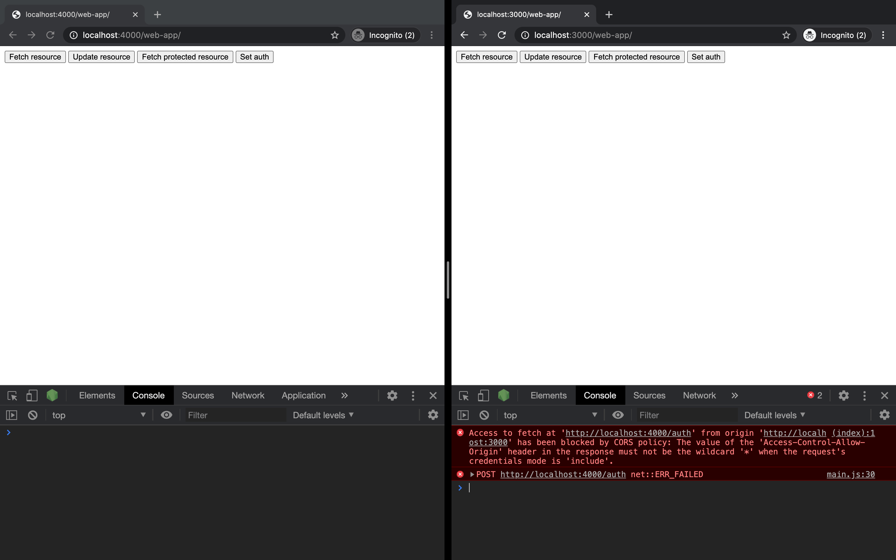
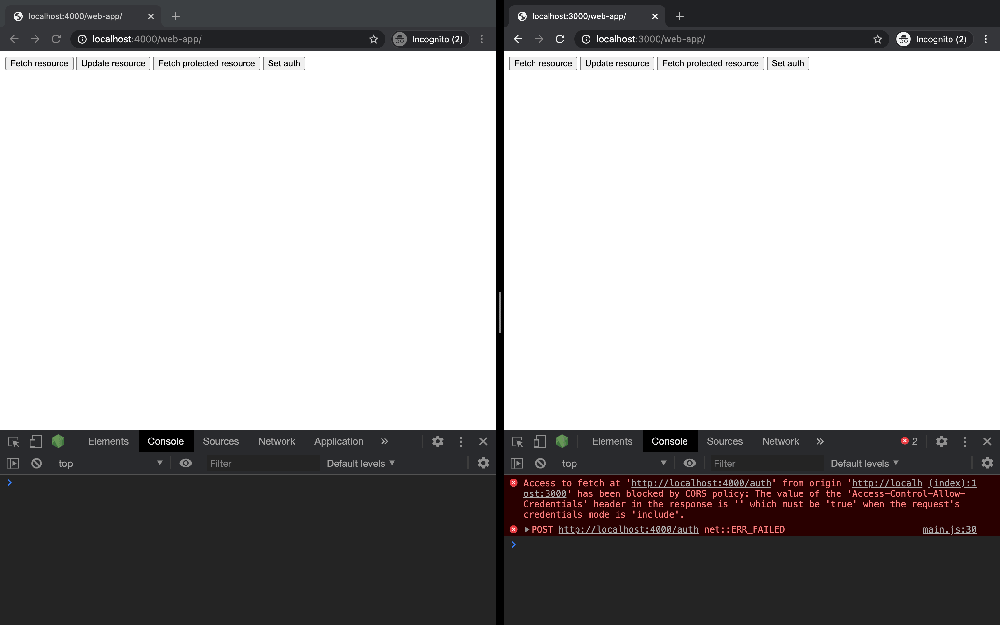
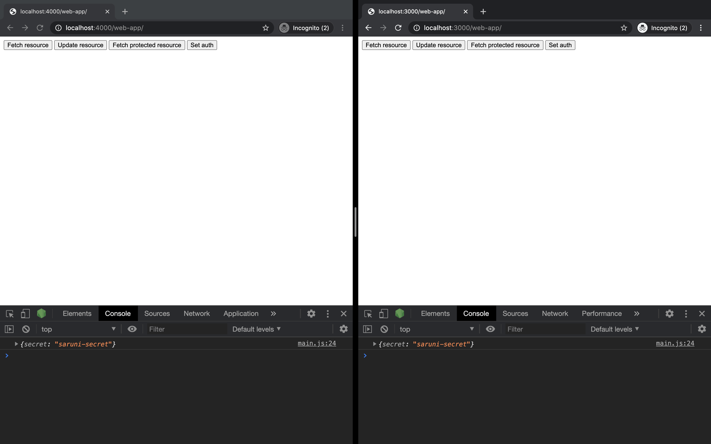

import { BasicCorsError, SameDomain } from "./images";

# CORS

Building full-stack web applications means connecting a frontend (where users interact) with an API (where data is retrieved).

Things may seem okay when developing those parts in isolation, but when brought together we may face errors relating to CORS. In this guide and [another](/guides/cors-aws-lambda), we’ll look at how to avoid common pitfalls—first learning about CORS generally, and then applied in the context of a Serverless environment on AWS Lambda as recommended for Saruni.

## What is CORS?

CORS (Cross-Origin Resource Sharing) is a safety feature in browsers that gives developers control over which resources can be shared or manipulated from other domains. This is achieved by setting CORS policies on the server-side and tweaking fetch requests.

Since CORS is for browsers and the AJAX (Fetch) API, server-side processes like `cURL` requests or use of the Node.js HTTP library (or some abstraction over it) are unaffected.

## Why do we need CORS?

CORS is all about security.

Imagine a world where `DOMAIN_B` wants to access—or even modify—a resource on `DOMAIN_A`: for example, updating a user profile. If `DOMAIN_B` is a trusted client of `DOMAIN_A` that may be okay, but the opt-in nature of CORS prevents a scenario where an un-trusted client is also able to update that resource.

# CORS in practice

In the following example, a web app invokes a fetch request for a resource. Since the web app and the REST API serving the resource are on the same domain (`DOMAIN_A` or, say `https://example-app.com`) there are no problems with CORS.

<SameDomain />

## First line of defence

In the next example we face a problem. Now, a second client sits on a different domain
(`DOMAIN_B`). With no configuration, attempts to request a resource will return a CORS error of the form:

> Access to fetch at `https://DOMAIN_A/resource` from origin `https://DOMAIN_B` has been blocked by CORS policy: No `Access-Control-Allow-Origin` header is present on the requested resource.

<BasicCorsError />

### Code sample

The example above shows the first line of defence from CORS. To see it in practice and explore resolutions, let’s create our own `DOMAIN_A` and `DOMAIN_B`.

The completed code shared below can be found in [this Git repository](https://github.com/tambium/saruni-samples/tree/master/guides/cors).

### Basic setup

We’ll use plain HTML and a sprinkling of JavaScript for the web apps and [Express](https://expressjs.com/) to serve up our domains.

We start by creating two servers: one on port `4000` and the other on port `3000`. Port `4000` is home to a REST API (serving a single resource) and one of the frontend web apps. Port `3000` serves a different frontend web app, with no REST API.

```js
import express from "express";

const resource = {
  username: "@saruni",
};

const DOMAIN_A = express();

// Serves contents of `public` directory (HTML, JavaScript)
// to `localhost:PORT/web-app`.
DOMAIN_A.use("/web-app", express.static("public"));

DOMAIN_A.get("/resource", (_, response) => {
  response.status(200).send({ resource });
});

DOMAIN_A.listen(4000, () => {
  console.log("DOMAIN_A is available on port 4000...");
});

const DOMAIN_B = express();

DOMAIN_B.use("/web-app", express.static("public"));

DOMAIN_B.listen(3000, async () => {
  console.log("DOMAIN_B is available on port 3000...");
});
```

Our frontend displays an HTML `<button>` that reaches out to the server on port `4000`.

```html
<html>
  <body>
    <button onclick="get()">Fetch resource</button>
    <script src="main.js"></script>
  </body>
</html>
```

```js
const get = async () => {
  const result = await fetch("http://localhost:4000/resource");
  console.log(await result.json());
};
```

After firing up our [basic setup](https://github.com/tambium/GUIDE_RESOURCE_cors-raw) with `yarn dev` we find our two web apps at `localhost:4000/web-app/` and `localhost:3000/web-app/`.

As expected, when we request the resource by clicking the button the client served on the same domain as the REST API retrieves the response from the server successfully.

The client served on a different domain to the REST API is blocked by CORS. This is the first line of defence from CORS in practice.


### Resolving access control error

The error makes clear that the problem relates to a lack of `Access-Control-Allow-Origin` headers on the requested resource.

We can confirm this is the case in the Network tab of our browser Developer Tools under the Response Headers.


To resolve this CORS error, we add the `Access-Control-Allow-Origin` header to the response on the server.

```js
DOMAIN_A.get("/resource", (_, response) => {
  response
    .header("Access-Control-Allow-Origin", "http://localhost:3000")
    .status(200)
    .send({ resource });
});
```

When we check back on the web app instance that was facing issues with CORS before, the error is resolved. Our resource is served successfully after configuring the access control headers on the server.


When we check the Network tab, we find the `Access-Control-Allow-Origin` header among the response headers.


### Bonus: wildcard origin

Despite allowing access to the resource from `http://localhost:3000`, requests from other domains would still receive CORS errors.

Should we wish to allow requests from every domain, we can use the wildcard selector on the server when defining our headers.

```js
DOMAIN_A.get("/resource", (_, response) => {
  response
    .header("Access-Control-Allow-Origin", "*")
    .status(200)
    .send({ resource });
});
```

## Second line of defence

A second kind of CORS error we might come across takes the following form:

> Access to fetch at `https://DOMAIN_A/resource` from origin `https://DOMAIN_B` has been blocked by CORS policy: Response to preflight request doesn’t pass access control check: No `Access-Control-Allow-Origin` header is present on the requested resource.

This error looks similar to the last but now makes reference to a preflight request. Preflight requests are triggered when a set of request conditions—best outlined in [this article](https://developer.mozilla.org/en-US/docs/Web/HTTP/CORS#Examples_of_access_control_scenarios), or more concretely in the [Fetch specification](https://fetch.spec.whatwg.org/)—are not met.

Generally speaking, we’ll trigger preflight requests if we use methods other than `GET`, `HEAD` or `POST` or if we use any method with a more sophisticated header.

### Generating a preflight request

We’ll add a second button to our web apps that invokes a new function.

```html
<button onclick="post()">Update resource</button>
```

```js
const post = async () => {
  const result = await fetch("http://localhost:4000/resource", {
    method: "POST",
    headers: {
      "Content-Type": "application/json",
    },
    body: JSON.stringify({ username: "@saruni-next" }),
  });
  console.log(await result.json());
};
```

On the server we’ll add a new method for our resource.

```js
DOMAIN_A.post("/resource", (_, response) => {
  response
    .header("Access-Control-Allow-Origin", "*")
    .status(200)
    .send({ resource });
});
```

We might expect our function to be successful on both domains since we included the access control header with a wildcard. However, to process JSON we set the `Content-Type` header to `application-json` which generates a preflight request.



### Deep dive on preflight requests

We can think of preflight requests like calling the cinema to check if tickets are available before jumping in the car to make our way over.

The preflight request provides information about the header and method and asks whether they are suitable given the server configuration.

As we see below, our preflight request asks whether a `POST` method with `content-type` headers is acceptable.



### Resolving preflight request error

Much like the call to the cinema, our server needs to respond to the preflight request to resolve the error.

We respond through the use of an `OPTIONS` verb.

```js
DOMAIN_A.options("/resource", (_, response) => {
  response.set("Access-Control-Allow-Origin", "*");
  response.set("Access-Control-Allow-Methods", "POST, OPTIONS");
  response.set("Access-Control-Allow-Headers", "Content-Type");

  response.sendStatus(200);
});
```

In the browser we see that the response headers are set accordingly and the error is resolved.



Since we know our content type is JSON, we can parse the body and mutate our in-memory DB for completeness.

```js
DOMAIN_A.post("/resource", bodyParser.json(), (request, response) => {
  response.set("Access-Control-Allow-Origin", "*");
  resource.username = request.body.username;
  response.status(200);
  response.send({ resource });
});
```

That’s all we need to know about preflight requests. They are sent by the browser to ask for information from the server before the actual request.

# CORS with credentials

Consider the following scenario where a new resource (`/protected_resource`) requires a cookie called `auth` for access.

```js
import cookieParser from "cookie-parser";

// Enable parsing of cookies on the request object.
DOMAIN_A.use(cookieParser());

DOMAIN_A.get("/protected_resource", (request, response) => {
  response.set("Access-Control-Allow-Origin", "*");

  if (!request.cookies.auth) {
    return response.sendStatus(401);
  }

  response.json({ secret: "saruni-secret" }).sendStatus(200);
});
```

Even after accounting for the lines of defence we have seen before, calling the endpoint will return a `401 (Unauthorized)` error since no cookie has been provided.



### Setting an auth cookie

To set a cookie, we add a new route to our Express API that returns a `Set-Cookie` header.

```js
DOMAIN_A.post("/auth", (_, response) => {
  response.set("Access-Control-Allow-Origin", "*");

  response
    .cookie("auth-cookie-name", "auth-cookie-value", { httpOnly: true })
    .sendStatus(204);
});
```

A new `<button>` in our web apps calls a fetch request to set the cookie through this route.

```js
const setAuth = async () => {
  try {
    const result = await fetch("http://localhost:4000/auth", {
      method: "POST",
    });

    console.log(await result.json());
  } catch {}
};
```

In the shared web app and API domain the cookie is set. However, in the separated (cross-origin) domain the `Set-Cookie` is found in the Response Headers but no cookie is set.

To set the cookie in this domain, we need to explicitly request credentials be communicated by the fetch request through the addition of the `include` field.

```js
// ...
const result = await fetch("http://localhost:4000/auth", {
  method: "POST",
  credentials: "include",
});
```



The cookies are set successfully in both domains, but we receive a new CORS error in our separated web app.

> Access to fetch at `http://localhost:4000/auth` from origin `http://localhost:3000` has been blocked by CORS policy: The value of the `Access-Control-Allow-Origin` header in the response must not be the wildcard `*` when the request's credentials mode is `include`.



### Resolving credentials include error

When credentials are communicated between different domains through `credentials: include` we need to be specific about the target domain in the `Access-Control-Allow-Origin` header rather than using wildcards because of the security implications.

In our case that means replacing the wildcard `"*"` with `http://localhost:3000`.

```js
DOMAIN_A.post("/auth", (_, response) => {
  response.set("Access-Control-Allow-Origin", "http://localhost:3000");

  response
    .cookie("auth-cookie-name", "auth-cookie-value", { httpOnly: true })
    .sendStatus(204);
});
```

With these changes we progress to a new CORS error.



> Access to fetch at `http://localhost:4000/auth` from origin `http://localhost:3000` has been blocked by CORS policy: The value of the `Access-Control-Allow-Credentials` header in the response is `''` which must be `'true'` when the request's credentials mode is `'include'`.

In order to allow credentials to move freely between domains we don’t just need to request it through our fetch method with `credentials: include`, we also need to enable it on the server. Remember, CORS is set up on the server. Our fetch methods may make requests but it’s the responsibility of the server to determine willingness to comply.

This is achieved in a similar fashion to how we enabled other CORS related configuration: with headers. Specifically, setting `Access-Control-Allow-Credentials` to `true`.

```js
DOMAIN_A.post("/auth", (_, response) => {
  response.set("Access-Control-Allow-Origin", "http://localhost:3000");
  response.set("Access-Control-Allow-Credentials", "true");

  response
    .cookie("auth-cookie-name", "auth-cookie-value", { httpOnly: true })
    .sendStatus(204);
});
```

### Reaching the protected route

After configuring all auth-related fetch methods with `credentials: include`, switching wildcards to specific domains and adding the `Access-Control-Allow-Credentials` headers on auth-related server responses we’re all set.



Our goal with this guide has been to demystify CORS by answering why it exists and how to tame it. In the [following guide](/guides/cors-aws-lambda), we’ll learn how to set up CORS with AWS Lambda and the Serverless framework.
