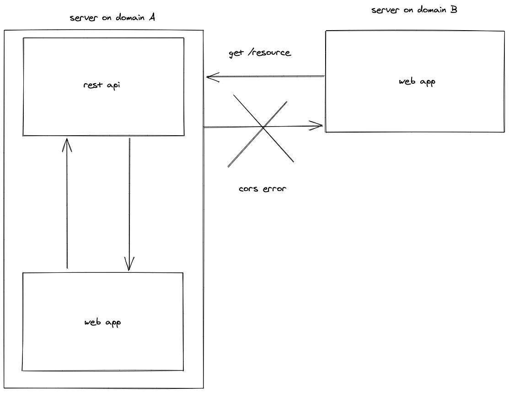
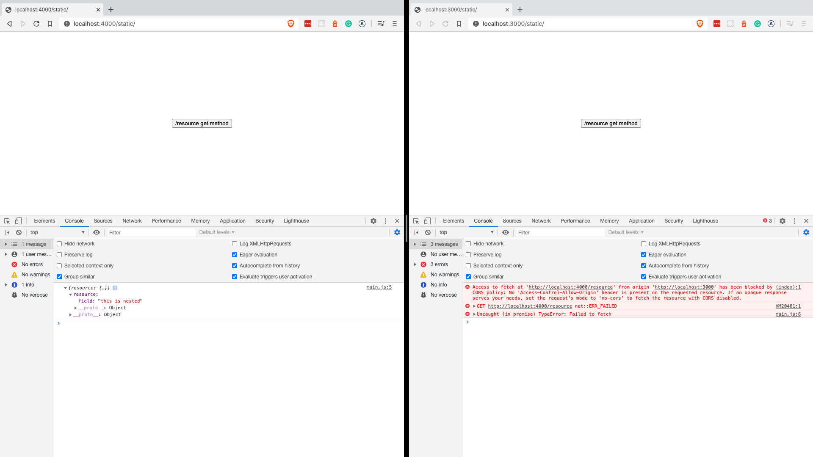
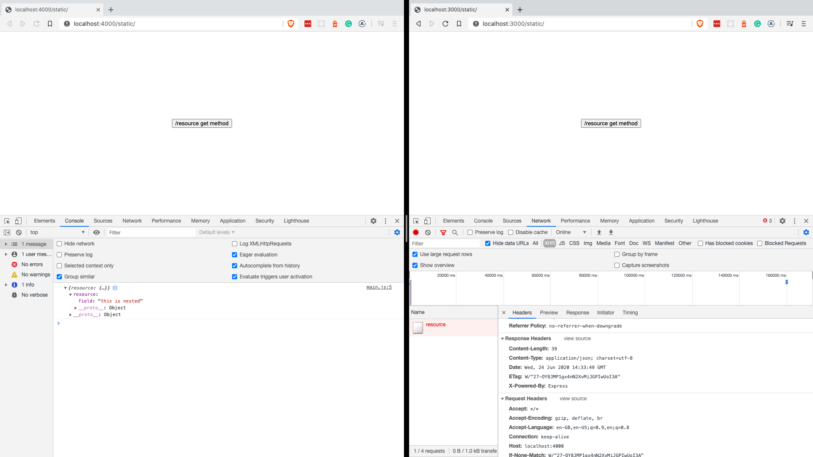
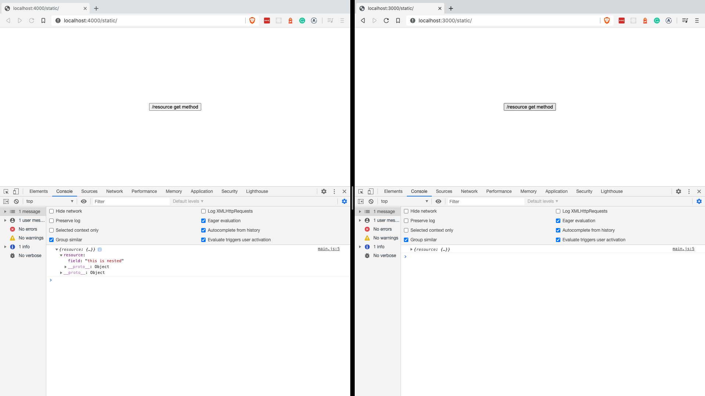
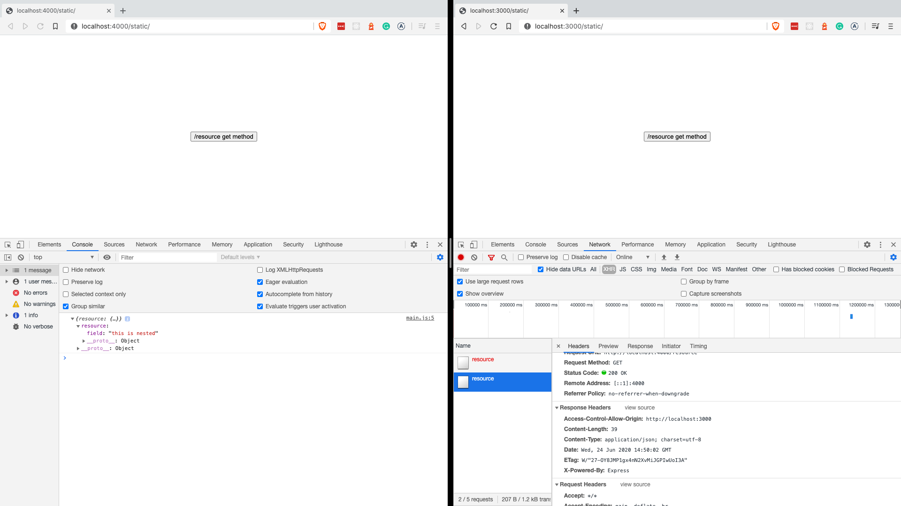
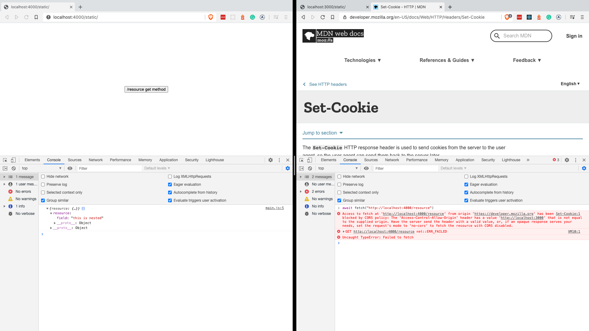
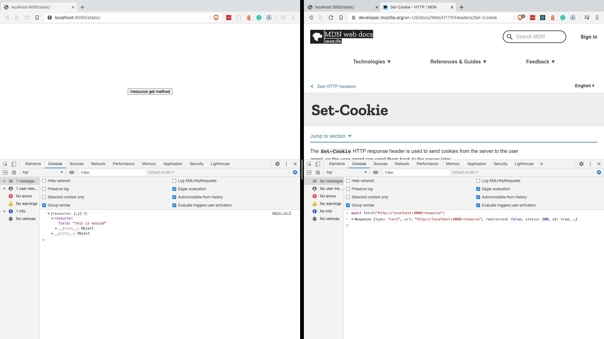

# intro 

Everybody is gangsta as long as CORS is working. When it doesn't. Well. In that sense cors is a lot similar to toilet rolls.

In this two part series will be looking into cors in general (this post) and cors with serverless and aws lambda [you can find it here](/guides/cors-aws-lambda). We try to debunk what the hack is going on.

# what is cors?

CORS (cross-origin-browser-request) is a safety feature in the browsers giving developers control over what resource can be shared/manipulated from other domains. CORS is configured on the server. Let's dissect this.

CORS is for browsers and their AJAX (fetch) API. That means when making `cURL` requests or using node's http library (or some abstraction over it) everyone is happy. No CORS there.

It must be configured on the server. The CORS policies must be set on the server. You need to tweak the fetch request, but if the server is not set up properly you are doomed to fail.

# why we have that?

Security. `Domain A` might want to access or even worse, modify a resource on `Domain B`. That might be fine if you want that on purpose. In a lot of cases that might not be a good idea. With CORS, we can control who can do what with the resources sitting in `Domain B`.

# how


Let's have a look at this picture. In a web app we can invoke fetch and request for a resource. Since both the web app and the resource sitting on the same domain (like `https://bestapp.com`) we have 0 problems.




On this picture however, a new guy emerged. It sits on a different domain, `Domain B`. This is a web app, just like the one sitting on `Domain A`. If it tries to access the same resource, we'll we get a classic CORS error.

# first line of defense

## show me the code

The picture we have seen above is the first line of defense in CORS. There are others we'll get into. Instead of talking or writing about them let's get into code and create our own `Domain A` and `Domain B`.

All the code can be found in [this git repo](https://github.com/tambium/GUIDE_RESOURCE_cors-raw).

## basic setup

We will travel back in time and use just plain html, css and javascript for the web app. The server: [express](https://expressjs.com/).

```ts
import express from "express";

const resource = {
  field: "this is nested",
};

const sameOriginApp = express();

sameOriginApp.use("/static", express.static("public"));

sameOriginApp.get("/resource", (_, response) => {
  response.status(200).send({ resource });
});

sameOriginApp.listen(4000, () => {
  console.log("Same-origin app is listening on port 4000...");
});

const differentDomainApp = express();

differentDomainApp.use("/static", express.static("public"));

differentDomainApp.listen(3000, async () => {
  console.log("This server is running on port 3000");
});
```

What happens in this code? We created two servers: one serving on port `4000` and one is on `3000`.

The one that serves on port `4000` is the home of our rest API and a frontend. The other serves a different frontend only. No rest api there.

Our rest api is not too sophisticated, neither it will be. We have one resource called the `/resource`. Not too creative.

Let's have a look at the frontend.

```html
<html>
  <head>
    <link rel="stylesheet" type="text/css" href="index.css" media="screen" />
  </head>
  <body>
    <div class="buttons">
      <button onclick="get()">/resource get method</button>
    </div>
    <script src="main.js"></script>
  </body>
</html>
```

```js
const apiEndpoint = "http://localhost:4000/resource";

const get = async () => {
  const result = await fetch(apiEndpoint);
  console.log(await result.json());
};
```

The frontend just shows a `<button />` that reaches out to the server on port `4000`. (Rest API)

Later more buttons will be added to the frontend but they will just call fetch with different values. Another reminder: check out the accompanying [git repo](https://github.com/tambium/GUIDE_RESOURCE_cors-raw) if you are curious.



After firing up the app this picture greats us. The two app side by side.

We have one button in the screen that invokes the only resource with a `get` method.

As we expected the app that sits on the same domain as the rest API retrieves the response from the server.

The other is blocked by CORS. That is the first line of defense. CORS prevents other domains from accessing the resource. Period. The frontend on port `3000` is blocked from getting any data from the rest API on port `4000`.

## add basic cors setup

The error says that there is no `Access-Control-Allow-Origin` header present in the response.

We can check this out on the networks tab.



And this is true. There is no header like this. To implement basic CORS setup on the server all we have to do is to add the `Access-Control-Allow-Origin` header to the response. How? Like this.

```js
sameOriginApp.get("/resource", (_, response) => {
  response
    .header("Access-Control-Allow-Origin", "http://localhost:3000")
    .status(200)
    .send({ resource });
});
```

As a reminder from few lines earlier. CORS is set up on the server. The server decides who can access what. It turns out enabling the basics of CORS is pretty simple. We just need to add a header that was mentioned in the error.

The value of the header will be the origin, where we would like to allow requests from. In our case this is `http://localhost:3000`.

Getting back to our app sitting on port 3000 and fetching the api one more time we see it succeeding.





Having a look at the networks tab we see the `Access-Control-Allow-Origin` header is among the response headers.

## more on origin

What happens with other domains? Good question. Although we have allowed request coming from `http://localhost: 3000` in our server, what happens when we want to reach it from another domain? For example, MDN (https://developer.mozilla.org/).



This happens.

It tells us that the origin that was specified on the header (`http://localhost: 3000`) is not the same origin as MDN.

This makes sense as we specified `http://localhost: 3000`, not MDN (http://developer.mozilla.org)

To make that pass we can change the value of our header.

```js
sameOriginApp.get("/resource", (_, response) => {
  response
    .header("Access-Control-Allow-Origin", "*")
    .status(200)
    .send({ resource });
});
```

This time the server allows request from **every** domain. Wildcard means the same as wildcard means elsewhere: allow every domain to access our resource.



# second line of defense

In terms of CORS there are simple requests and not so simple request. Instead of me trying to explain what singe requests are in the context of CORS, I will just copy it from MDN (find the full article [here](https://developer.mozilla.org/en-US/docs/Web/HTTP/CORS).

One of the allowed methods:

* GET
* HEAD
* POST

Apart from the headers automatically set by the user agent (for example, Connection, User-Agent, or the other headers defined in the Fetch spec as a “forbidden header name”), the only headers which are allowed to be manually set are those which the Fetch spec defines as a "CORS safe listed request-header", which are:

* Accept
* Accept-Language
* Content-Language
* Content-Type (but note the additional requirements below)
* DPR
* Downlink
* Save-Data
* Viewport-Width
* Width

The only allowed values for the Content-Type header are:

* application/x-www-form-urlencoded
* multipart/form-data
* text/plain

No event listeners are registered on any XMLHttpRequestUpload object used in the request; these are accessed using the XMLHttpRequest.upload property.

No ReadableStream object is used in the request.

If you want the tl;dr

Some requests don’t trigger a CORS preflight request. Those are called “simple requests”. The rest does trigger a preflight request (more on preflight requests just in a bit). They are complex.

Mainly that means a request is simple if:

* it is either GET, POST or HEAD
* does not have fancy header

## create a post resource

Let's move carefully from the simple request to the not that simple. On the web apps I added a second button that invokes this function.

```ts
const post = async () => {
  const result = await fetch(apiEndpoint, {
    method: "POST",
  });

  console.log(await result.json());
};
```

In the server I added a new method for the the `/resource` resource.

```js
sameOriginApp.post("/resource", (_, response) => {
  response
    .header("Access-Control-Allow-Origin", "*")
    .status(200)
    .send({ resource });
})
```


Nothing new here. POST in itself is a simple request, so with the `Access-Control-Allow-Origin` header we are good to go.

But with a POST request we usually want to do more then we would do with a GET request. Sending data and hopefully do some mutation in the backend.

For that we need to do modification in the fetch request.

```js
const post = async () => {
  const result = await fetch(apiEndpoint, {
    method: "POST",
    headers: {
      "Content-Type": "application/json",
    },
    body: JSON.stringify({ field: "change" }),
  });

  console.log(await result.json());
};
```

To process json we need to set header `content-type` to `application/json`. Problem is, that pushes our request from being a simple to being a complex one.


The browser is no complaining about preflight request.

## preflight request

If our request is not a simple one (i.e. it is not GET, HEAD, POST and / or it has fancy headers) then the browser makes a preflight request to the server before the actual one.

It is sort of calling the cinema if they have tickets before getting into the car, instead of just showing up there.


Preflight requests gives information about the header and the method. Is Content-type allowed? Is DELETE HTTP verb fine?

In the preflight **request** we can see the browser sends two headers:

* Access-Control-Request-Headers: content type
* Access-Control-Request-Method: post


That is asking: the method will be a POST with `content-type` headers. Good to go?

To have an answer from the server we need to create an `OPTION` verb that will say: yes!

```js
sameOriginApp.options("/resource", (_, response) => {
  response.set("Access-Control-Allow-Origin", "*");
  response.set("Access-Control-Allow-Methods", "POST, OPTIONS");
  response.set("Access-Control-Allow-Headers", "Content-Type");

  response.sendStatus(200);
})
```

This method just answers the preflight request. In the browser we can see that the response headers are set accordingly.


Note: the origin header is still present in the POST handler.

One more step. Since we know the type is json we can parse the body and mutate our "db".

```js
sameOriginApp.post("/resource", bodyParser.json(), (request, response) => {
  response.set("Access-Control-Allow-Origin", "*");

  resource.field = request.body.field;

  response.send({ resource });
});
```

That is all about preflight requests. They are sent by the browser to get some information from the server before sending the real one.

# credentials

The third line of defense adds more complication on the top of what we learnt. 

Let's consider this scenario. We have the `/resource` resource. We want to have another one called `/protected_resource`. It will require a cookie called auth. Otherwise you can't access the resource.

```js
import cookieParser from "cookie-parser";

// to parse the cookies on th request object
sameOriginApp.use(cookieParser());

// the route
sameOriginApp.get("/protected_resource", (request, response) => {
  if (!request.cookies.auth) {
    return response.sendStatus(401);
  }

  response.json({ protected: "top secret" }).sendStatus(200);
});
```

Calling the endpoint will give us a big `401` because we don't have a cookie.


## set an http cookie

It could not have passed our authentication since we don't have any cookie. The way to do that is another route in our express API that will return a `Set-Cookie` header.

```ts
sameOriginApp.post("/auth", (_, response) => {
  response
    .cookie("auth", "authHeaderContent", { httpOnly: true })
    .sendStatus(204);
});
```


Clicking on the newly added `<button />` (you can check the frontend, but its just another fetch request) we should be able to reach out to the rest API.

Here is our cookie. Now we should be able to retrieve our protected resource. 


And here it is. With the help of the cookie we were able to reach to the API.

## cors

We made it work with the same domain app. Comes the harder part. CORS.

Clear the cookie and see what is happening.


The very first issue is the basics of cors. `/protected_resource` is a GET method without headers -> simple cors request.

All we need is the `Allow-Control-Origin-Header`.

```js
sameOriginApp.get("/protected_resource", (request, response) => {
  response.set("Access-Control-Allow-Origin", "*");

  if (!request.cookies.auth) {
    return response.sendStatus(401);
  }

  response.json({ protected: "top secret" }).sendStatus(200);
});
```

There is nothing new here. Just adding the header as we did in the beginning of this article.

Now we removed CORS error for a `401`. But that is fine, we did not have any cookie.


Let's try to get one.

## auth

The way to get a cookie is to reach the `/auth` endpoint.

Hitting the `/auth` endpoint gets us back the same CORS error. Let's put the origin header there as well.

```js
sameOriginApp.post("/auth", (_, response) => {
  response.set("Access-Control-Allow-Origin", "*");

  response
    .cookie("auth", "authHeaderContent", { httpOnly: true })
    .sendStatus(204);
});
```


Strange thing! No CORS errors, the `Set-Cookie` header is in the response, yet there is no cookie present in the applications tab.

## credentials

We need to explicitly request credentials (like cookies) to be communicated by the fetch request. How? By adding the credentials `include` field.

```js
const set_header = async () => {
  try {
    const result = await fetch(setHeaderEndpoint, {
      method: "POST",
      credentials: "include",
    });

    console.log(await result.json());
  } catch {}
};
```


Something is just not right. We received a new kind of CORS error: wildcards are not permitted while using credentials.

First rule: when credentials are communicated between different domains (credentials set to `include`) we can't get away with the `"*"` in the `Access-Control-Allow-Origin` header. We need to be specific since with potential authentication there is much more security concerns.

Let us be more specific. Replace `"*"` with `http://localhost:3000`.

```ts
sameOriginApp.post("/auth", (_, response) => {
  response.set("Access-Control-Allow-Origin", "http://localhost:3000");

  response
    .cookie("auth", "authHeaderContent", { httpOnly: true })
    .sendStatus(204);
});]
```


Everyone is happy now? Nope. turns out allowing credentials to move freely between domains we don't just need to request it by fetch (setting `credentials` to `true`) but we actually need to enable it on the server. (Remember: CORS is set up on the server. Fetch request things and the server may or may not comply) This needs to be done in a similar way we enabled all other CORS related setting: with headers.

The header for that is called `Access-Control-Allow-Credentials`.

Lets set it to `true`.

```ts
sameOriginApp.post("/auth", (_, response) => {
  response.set("Access-Control-Allow-Origin", "http://localhost:3000");
  response.set("Access-Control-Allow-Credentials", "true");

  response
    .cookie("auth", "authHeaderContent", { httpOnly: true })
    .sendStatus(204);
});
```


Boom! the cookie is there. First job is done. Lets start using it.

## hitting the protected route

Unfortunately we hit an unathorized error despite having the cookie. The reason for thatannoying problem is fetch: we have not defined credentials include.

Reminder: the `include` in the previous section was to **retrieve** the cookie from a different domain. We retrieved it. Now we need to **send it back** to the `/protected_route` endpoint. Again, different domain, so we need to set `credentials`: `include`.


```js
const protected_get = async () => {
  try {
    const result = await fetch(protectedResourceEndpoint, {
      method: "GET",
      credentials: "include",
    });

    console.log(await result.json());
  } catch {}
};
```


We are better now. We are at the same problem we had encountered with the `/auth` route.

That is the wildcard issue.

```ts
sameOriginApp.get("/protected_resource", (request, response) => {
  response.set("Access-Control-Allow-Origin", "http://localhost:3000");

  if (!request.cookies.auth) {
    return response.sendStatus(401);
  }

  response.json({ protected: "top secret" }).sendStatus(200);
});
```

The wildcard issue is gone now.


But now we are facing the missing `Access-Control-Allow-Credentials` on the `/protected_route`. By this time we are experts at setting CORS headers.

```ts
sameOriginApp.get("/protected_resource", (request, response) => {
  response.set("Access-Control-Allow-Credentials", "true");
  response.set("Access-Control-Allow-Origin", "http://localhost:3000");

  if (!request.cookies.auth) {
    return response.sendStatus(401);
  }

  response.json({ protected: "top secret" }).sendStatus(200);
});
```


Whoooa, finally we are here. The `/protected_resource` is in our hands! Even CORS couldn't get in our way.

Hopefully we demystified what CORS is, why it exists and how to tame it. In the [following article](/guides/cors-aws-lambda) we'll see how to set up CORS with AWS Lambda and the Serverless framework.
