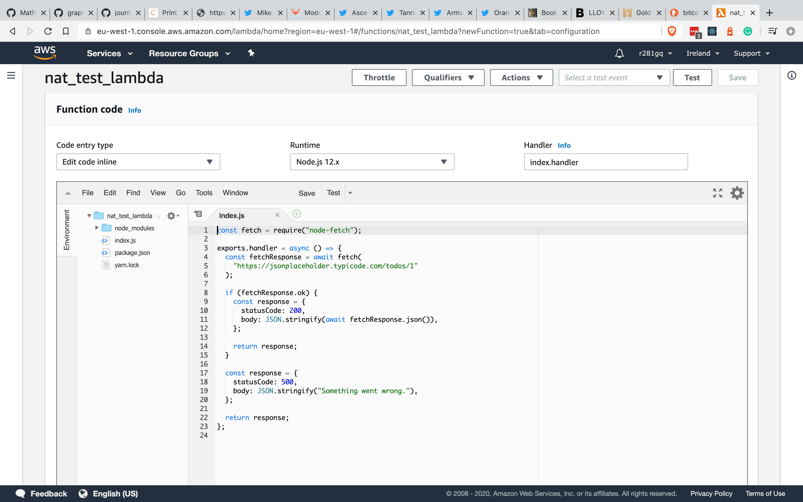
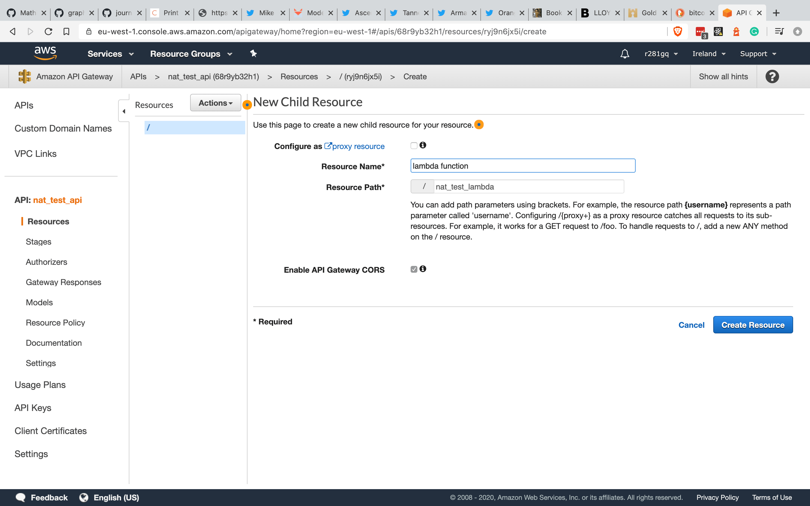
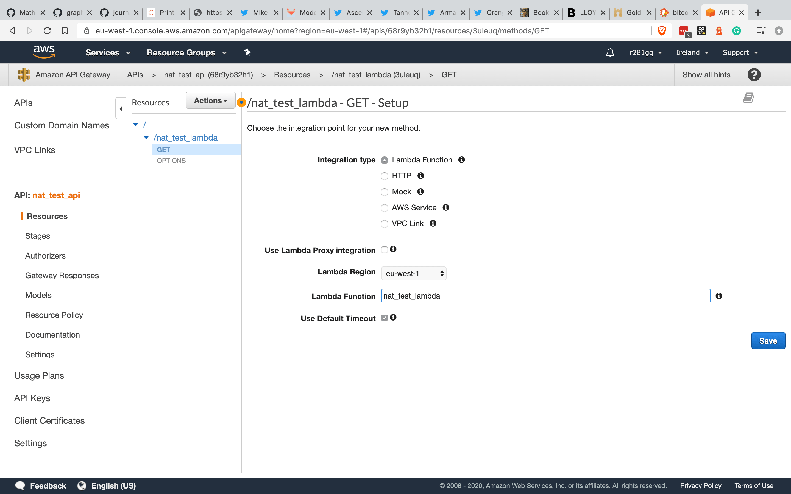
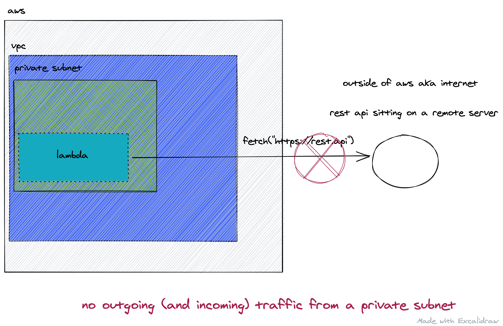
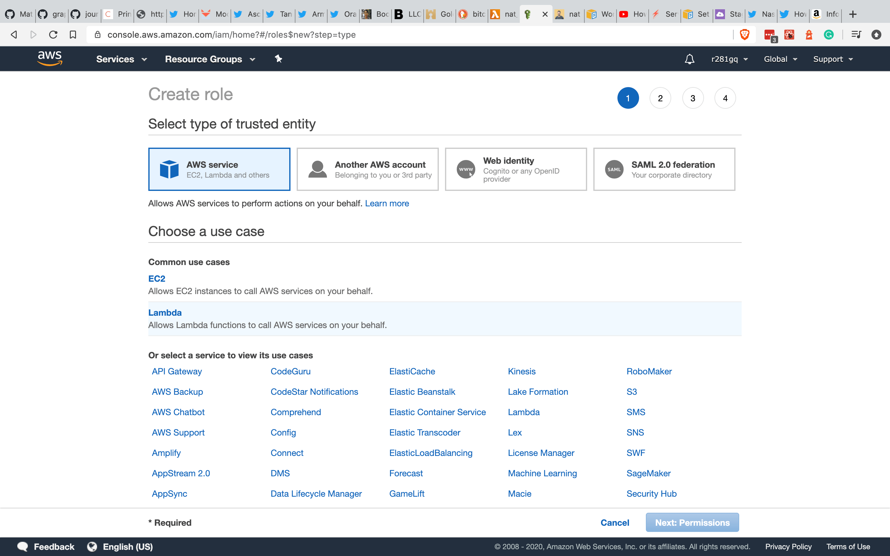

# NAT instance

If we have a resource sitting inside a [VPC](https://aws.amazon.com/vpc/) and a [private subnet](https://docs.aws.amazon.com/vpc/latest/userguide/VPC_Subnets.html), sooner or later we encounter the problem of connecting to the outside world.

In this guide, we’ll demonstrate the problem and the solution using a [Lambda](https://aws.amazon.com/lambda/) function as our resource, which we’ll try to connect to with a Fetch request.

We start by creating a Lambda function that’ll use Fetch itself to consume a REST API—specifically, the [JSONPlaceholder](https://jsonplaceholder.typicode.com/) API often used for testing.

# Practical example

```js
const fetch = require("node-fetch");

exports.handler = async () => {
  const fetchResponse = await fetch(
    "https://jsonplaceholder.typicode.com/todos/1"
  );

  if (fetchResponse.ok) {
    const response = {
      statusCode: 200,
      body: JSON.stringify(await fetchResponse.json()),
    };

    return response;
  }

  const response = {
    statusCode: 500,
    body: JSON.stringify("Something went wrong."),
  };

  return response;
};
```

## Lambda and REST API

Since this guide uses a simple example we can skip use of Serverless and manually build the infrastructure for our Lambda. First, we create the function itself.

### Creating the Lambda function

From the AWS dashboard, we create a new function in the Lambda service. We add a name and the first step is complete.


Back on our local machine we create a script in our `package.json` that bundles our function to a `zip` file, ensuring to clear old artifacts as part of the process.

```json
{
  // ...
  "scripts": {
    "bundle": "rm -rf bundle.zip && zip -r bundle.zip ."
  }
}
```

### Uploading our Lambda function

When we select our newly created Lambda in the AWS dashboard we’ll be presented with the text editor view. From here, we can upload the `zip` file we just created.


Once the upload is complete, we see our code.



Our Lambda is now sitting in the cloud but nothing can call it. To fix that, we create an HTTP event.

### Creating an HTTP event

We head to the [API Gateway](https://aws.amazon.com/api-gateway/) service in AWS and choose the (non-private) REST API type.


We choose a suitable name (`nat_test_api`) and press Create API to land in the API dashboard.



Since this is a REST API, our resources are URL endpoints. We create a new one that’ll invoke our Lambda function.


REST APIs operate with HTTP verbs. The basic is `get`, mostly used to retrieve a resource. This is what we’ll use and in the API Gateway service, creating the method is as simple as clicking on action and selecting `get`.

Once created, we can assign our Lambda to our `get` verb so hitting the endpoint will call our function.



We have our Lambda integrated with our REST endpoint, but the next question is which URL to invoke? We can find the invocation URL in the stages tab of the dashboard.


We can test our endpoint using `cURL`. For reference, the general structure of REST APIs created with API Gateway are as follows:

`https://REST_API_ID.execute-api.REGION.amazonaws.com/STAGE/FUNCTION_NAME`


Success! Our Lambda is deployed and reachable through our REST API.

## Resources inside a VPC

There are times when we need to put our functions inside a VPC. That might happen because another resource (like a database or cache) sits inside the VPC, so one of the ways to have access to them is to put the Lambda there as well.

So far, our Lambda is sat on AWS outside a VPC and is more than happy to communicate with the outside world.


When we use Lambdas inside a VPC things change. We can no longer connect to the internet since our function sits inside a private subnet. Outgoing requests cannot escape a private subnet (a subnet that has no [Internet Gateway](https://docs.aws.amazon.com/vpc/latest/userguide/VPC_Internet_Gateway.html)) by default.



### Creating a VPC

To illustrate the problem, we create a VPC from the VPC service.


We can then create three private subnets mapping to three availability zones.


### Creating a role

Our Lambda must be able to use AWS resources, but Lambda functions are not launched with the required privileges by default. To add them, we assign a new role.

A [role](https://docs.aws.amazon.com/IAM/latest/UserGuide/id_roles.html) is part of the AWS security paradigm and defines what the holder can do. Roles can be attached to users (console, cli or real humans) or resources—in our case, a Lambda.

By default, Lambdas are launched with a role that allows for access to the [Cloudwatch](https://aws.amazon.com/cloudwatch/) logging service. From the IAM service, we can create a new `AWSLambdaVPCAccessExecutionRole` role that will allow use of AWS resources.




### Assigning role to our function

In the dashboard of our Lambda we select the permissions tab and assign the role we created.


So far we have created our VPC and subnets and created a role so our Lambda can access resources inside a VPC. Next up we need to place our Lambda inside the VPC.

### Moving Lambda to our VPC

Back in the main dashboard view for our Lambda, we can scroll down and find the VPC section. There we can add our newly created VPC with the three private subnets and the default security group that ships with our VPC.


After saving our configuration, we can try to `cURL` our endpoint but we’ll find errors, since the outgoing fetch request cannot reach the internet.


# Our (cheaper) solution

AWS has dedicated solution to the problem of allowing outgoing traffic from a VPC called a [NAT Gateway](https://docs.aws.amazon.com/vpc/latest/userguide/vpc-nat-gateway.html), but it is quite expensive. Since one objective of utilizing Serverless infrastructure is cost savings we were interested in other solutions.

## Nat instance

A NAT instance is an EC2 instance designed to do [NAT mapping](https://en.wikipedia.org/wiki/Network_address_translation).

We still have our Lambda sitting in a private subnet, but now we introduce a new element: a public subnet. A public subnet is a subnet with an Internet Gateway, which means it can receive incoming traffic and—with a little configuration—can allow outgoing traffic.


We have a NAT instance that will do address translation between private and public addresses, but what is that translation exactly?

Our Lambda wants to reach out to the JSONPlaceholder API. All traffic will be forwarded to the NAT instance since the Lambda itself is in a private subnet and has no direct internet connection. The NAT instance recognizes that it has received traffic from the Lambda and that the function would like to call the JSONPlaceholder API. It then sends the request on behalf of the Lambda. When the the request comes back, the NAT instance remembers it came from our function and forwards the result back to it.

Security groups determine which requests are allowed out, and from where. By default, the NAT instance will not allow incoming traffic from any resource, so we’ll need to configure it to allow traffic to and from the Lambda.

In our case, we’ll attach a security group to the NAT instance that allows all traffic from the Lambda function. The Lambda is identified by another security group.

## Creating a public subnet

First we create our public subnet, which is just a subnet with an Internet Gateway.


## Creating an Internet Gateway

Creating an Internet Gateway is simple: just a few clicks through the Create Internet Gateway form found in the Internet Gateway section of the VPC service.

Once created, we select our new gateway and choose Attach from the Actions dropdown before connecting the VPC where our subnets reside.


## Pointing to the Internet Gateway

The last step is to head to the route table of the public subnet and add a line that intercepts all traffic (`0.0.0.0/0`), routing it to our Internet Gateway. That means if there is no other route that would catch it, just forward it to the Internet Gateway.


## NAT instance in practice

The rest of the guide draws inspiration from [this post](https://www.theguild.nl/cost-saving-with-nat-instances/), so a huge thanks to [Luk Van Den Borne](https://www.theguild.nl/authors/luk-van-den-borne/).

The NAT instance is just an EC2 machine. It will have a single job: do port mapping on behalf of another resource. In this case, our Lambda function.

### Creating a NAT instance

Since NAT instances are EC2 virtual machines, we head to the EC2 service in AWS to get started. We go through the instance creation process with the default settings applied and ensure we save the private key, which we’ll use to SSH into our machine.


### Enabling port forwarding

Our virtual machine is not set up to do forwarding and mapping by default. We enable it ourselves by connecting to the machine, which we can do from our terminal by running the following command:

```sh
ssh -i PRIVATE_KEY_NAME.pem ec2-user@EC2_PUBLIC_ADDRESS
```

Alternatively, we can connect to the machine from the AWS dashboard by selecting the VM and clicking connect.

We run the following two commands to configure the VM:

```sh
sudo sysctl -w net.ipv4.ip_forward=1
sudo /sbin/iptables -t nat -A POSTROUTING -o eth0 -j MASQUERADE
```


### Disabling destination check

AWS blocks requests in EC2 VMs that do not come from the instance unless we disable source checks. However, this EC2 instance is a middleman between the internet and the Lambda, so its purpose is to let traffic flow through it.


### Private subnet route table

The last step here is to put the NAT instance as the target in the private subnet’s route table, which allows traffic (like an HTTP request) from a resource in a private subnet (like our Lambda) to be routed to the NAT instance.

We head to the VPC service, navigate to our private subnet and find the route table that is associated with it. There we add a new route row that should map the `0.0.0.0/0` CIDR block to the ID of the EC2 instance as the target.


### Configuring firewall settings

Our set-up is largely complete. To recap, here’s what we’ve done so far:

- Created our VPC
- Created a public subnet with Internet Gateway
- Put our Lambda inside the private subnet
- Attached suitable execution role to Lambda
- Created an EC2 VM
- Enabled port forwarding
- Disabled destination check
- Modified route table of our private subnet so all traffic goes to the NAT instance
- Modified route table of our public subnet so all traffic goes to the Internet Gateway


The problem is that although we modified the route table of the private subnet, AWS does not allow traffic automatically into EC2 instance. We need to explicitly allow traffic from the Lambda function to reach the VM.

First, we create a security group that we can attach to the Lambda function. This allows the NAT instance to identify where to accept requests from. It does not need any rules—its job is to have a reference to the resource it gets attached to.


We then create another security group that will be used by the NAT instance. It simply has an inbound rule to allow all traffic on all ports from the security group created above. For that, we select the security group ID that we created in the previous step.


This is what the two green circle in our sketch represent. We allowed traffic into the NAT VM from our Lambda.

### Attaching security groups

Our security groups are created but not yet attached to the resources. For that, we head back to the EC2 service and add the newly created security group to our VM.


We then do the same for our Lambda function, attaching our new security group here too.


## Conclusion

After following the steps outlined in this guide, our Lambda function should be able to connect with the internet, but fair warning: it can take some time for the changes to come into effect. We can confirm our configuration with `cURL` once again.


In the [next guide](/guides/nat-with-sls) we’ll create a Serverless template to automate the process covered here.
