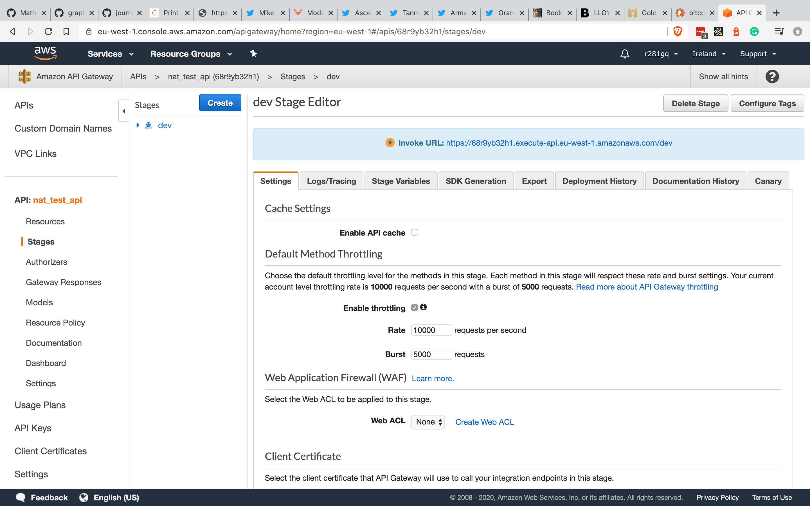
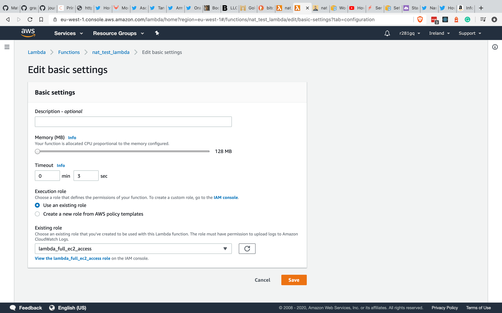
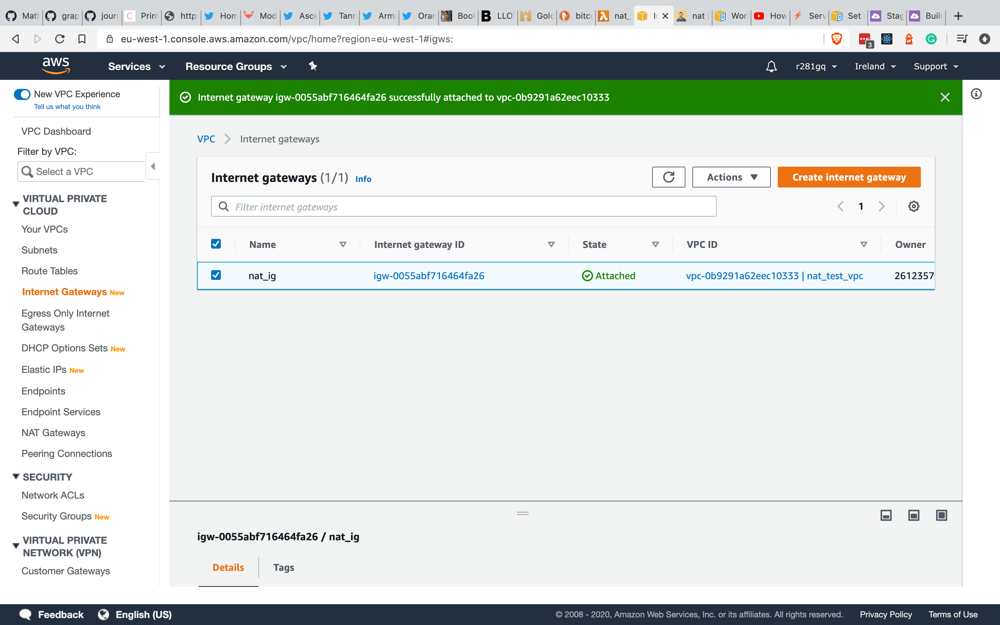
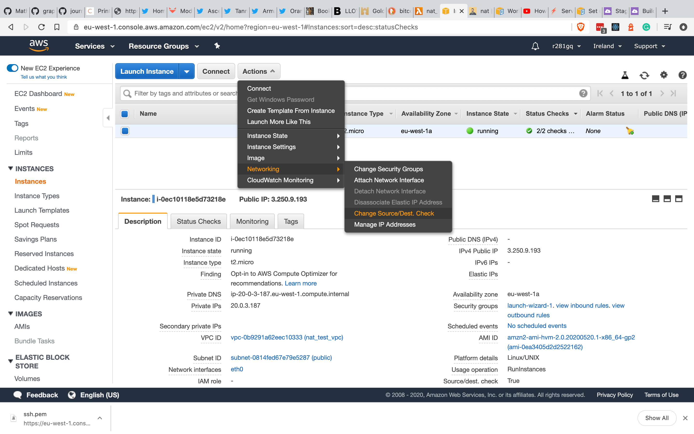
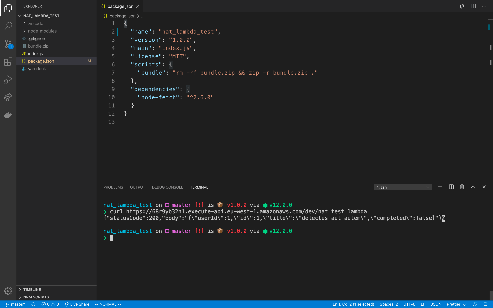

# NAT instance

If we have a resource sitting inside a [VPC](https://aws.amazon.com/vpc/) and a private [subnet](https://docs.aws.amazon.com/vpc/latest/userguide/VPC_Subnets.html), sooner or later we encounter the problem of connecting to the outside world.

In the case of this article, that resource will be a [lambda](https://aws.amazon.com/lambda/) function. We try use a Fetch request with a lambda that has a VPC.

To demonstrate the problem I create a lambda function that will use fetch to consume a rest API.

```js
const fetch = require("node-fetch");

exports.handler = async () => {
  const fetchResponse = await fetch(
    "https://jsonplaceholder.typicode.com/todos/1"
  );

  if (fetchResponse.ok) {
    const response = {
      statusCode: 200,
      body: JSON.stringify(await fetchResponse.json()),
    };

    return response;
  }

  const response = {
    statusCode: 500,
    body: JSON.stringify("Something went wrong."),
  };

  return response;
};
```

The code itself is really simple. All it does it reaches out to the [jsonplaceholder](https://jsonplaceholder.typicode.com/) api and returns the response.


# Create lambda and rest API

Without sls, we are building manually the infrastructure around this lambda. The first thing is to create the function itself.

## Create the the function

Let's give some name to our lambda function on the create function page. That will create the lambda for us.


Let's head back to our local machine. Create a script that bundles everything together to a `zip` file.

```json
{
  "name": "nat_lambda_test",
  "version": "1.0.0",
  "main": "index.js",
  "license": "MIT",
  "scripts": {
    "bundle": "rm -rf bundle.zip && zip -r bundle.zip ."
  },
  "dependencies": {
    "node-fetch": "^2.6.0"
  }
}
```

We prefixed that command with `rm rf bundle.zip` just to make sure we clear old files. Then we zip everything recursively to the `bundle.zip`. This way typing `yarn bundle` command will create the up to date `zip` file from our project folder.

## Upload

We have the text editor and dashboard page in AWS when we select our newly created lambda. After issuing `yarn bundle` we can upload the `zip` file to our AWS.


After it has finished, we can see the code.


Our lambda is sitting in the cloud but nothing really can call it. Lets create an http event for it.

## API Gateway

First we need to go to the [API Gateway](https://aws.amazon.com/api-gateway/) section and select Rest API (**not** the private, inside vpc section).


I gave it the name `nat_test_api`. After pressing create API we find ourselves in the API dashboard.


This is a Rest API, so resources are url endpoints. We need to create one, so hitting that will invoke our lambda function.


Rest API operates with http verbs. The basic is `get`, mostly used to retreive a resource. This is what we need now.

Creating a method is just clicking on action and selecting get.


The last thing is to assign our lambda to the get verb so hitting that endpoint will call the function. Now we have the lambda integrated to a rest endpoint. But what is the url to invoke? We can go the the stages part and there we see the invoke url



Great. Everything is ready. So if I `cURL` with the following command I expect to see some results.

In my case it is:

```sh
curl https://68r9yb32h1.execute-api.eu-west-1.amazonaws.com/dev/nat_test_lambda
```

But don't try to invoke it. Yours is different. The general structure of the Rest API endpoint is:

`https://{restAPIId}.execute-api.{region}.amazonaws.com/{stage}/{functionName}`


Amazing. Our lambda just got deployed and reachable through the Rest API. So what is the problem?

# Resources inside a vpc

There are times when we need to put our functions inside a VPC. That might happen because another resource (like a database or cache) sits inside the VPC, so one of the ways to have access to them is to put the lambda there as well.


This is what happened so far. Lambda sits in AWS and is more than happy to Fetch and just generally communicate with the outside world.

When we use lambdas inside a VPC this is how it changes.


When we put a lambda inside a VPC it can no more connect to the internet. It sits inside a private subnet. On outgoing request cannot escape a private subnet (a subnet that has no [Internet Gateway](https://docs.aws.amazon.com/vpc/latest/userguide/VPC_Internet_Gateway.html)) by default.

## Create a vpc

To see the problem we must first create a VPC with some private subnets.

In the VPC section we can create a new VPC.


As a next step, we can create 3 private subnets mapping to the three regions.


## Create a role

One more step we need. Our lambda must be able to use AWS resources. That is the whole point why we would put a lambda inside a VPC. But lambda functions do not have the privilage to do that by default. To do that we must assign a new role to it.

A [role](https://docs.aws.amazon.com/IAM/latest/UserGuide/id_roles.html) is part of AWS security paradigm. A role defines what the holder of the role can do. Roles can be attached to users (console/cli or real humans) or resources. So in this case we attach a role to our lambda so it can do what the role allows it to do.

By default lambda comes with a role that allows it to assess [Cloudwatch](https://aws.amazon.com/cloudwatch/), a logging service. In the VPC section we can create a new role by selecting `AWSLambdaVPCAccessExecutionRole`. That will allow whoever holds this role to use aws resources.


## Assign role to the function

The last thing is to assign this role to our lambda.



In the dashboard of our lambda we can choose the permissions tab and in there the existing role option.

So far we have created our VPC and subnets. Also we created a role so our lambda can access resources inside a VPC. But how to place our lambda inside VPC? It is still not part of it.

## Putting the lambda inside the VPC


After pressing save we can go back the first page of the dashboard where the inline code editor is and scroll down until we see the VPC section. There we can add our newly created VPC with the three private subnets and the defult security group that comes with our VPC.

Clicking on save we can head to the terminal and try `cURL` on our endpoint.


As we can see it errors, since the outgoing fetch request can't get into the internet.

# A (cheap) solution

AWS has dedicated solution to this problem (allowing outgoing traffic from a VPC) called [NAT Gateway](https://docs.aws.amazon.com/vpc/latest/userguide/vpc-nat-gateway.html). Although it is quite expensive. The whole point of the serverless infrastructue (apart from abstracting away the nitty gritty and provding scaling) is the price point. Having a NAT Gateway kinda defeats that purpose. That is not say the dedicated NAT Gateway is not much better. Of course they are. When it comes to scaling, we need to choose them.

We can create a cheaper solution however until that point.

## Nat Instance.

NAT Instance is simply an EC2 instance designed to do [NAT mapping](https://en.wikipedia.org/wiki/Network_address_translation). How does this solution looks like?


We still have our lambda sitting in a private subnet. But now we introduce a new element: a public subnet. A public subnet is a subnet with an Internet Gateway. So it can receive incoming traffic and with a bit of a help it can allow outgoing traffic from the subnet itself.

We have a NAT Instance that will do the address translation between private and public addressess. What is that translation exactly? The lambda wants to reach out to the jsonplaceholder API. All the traffic will be forwared to the NAT instance. Remember. Lambda is in a private subnet. It has no direct internet connection. The NAT instance sees that it received traffic from the lambda. The lambda would like to go go to the jsonplaceholder API. It send the request on behalf of the lambda. When the the request comes back, the NAT instance is smart enough to remember: it was coming from the lambda so it needs to forward the result back to it.

The security groups tell from where and what request can go out. By default the NAT instance will not allow incoming traffic from any resource. We need to tell it to allow traffic from and to the lambda.

In this case we attach a security group to the NAT instance that allow all traffic from the lambda function. The lambda is identifed by an other security group. So in our case the secuirty group serves an identification porpuse.

## Public subnet

The very first thing is to create a public subnet. That is just a subnet with an Internet Gateway.


## Internet gateway

Private and public subnets are the same. Except public subnets have an Internet Gateway attached to them. That allows traffic flowing through them.

Creating an Internet Gateway is really easy. Just a few click in the vpc/internet gateway/create internet gateway section.

After the gateway has been created we need to select it, and in the action dropdown we need to select attach. There we need to select the vpc where our subnets reside.



If everything went well this should be the picture we should be looking at. 

## Create a route that point to the internet gateway


Last step is to go the the route table of the public subnet and add a line that intercepts every traffic (`0.0.0.0/0`) and routes it to our Internet Gateway. That means if there is no other route that woul catch it, just forward it to the Internet Gateway.

## What is a nat instance?

The rest of the post draws inspiration from [this post](https://www.theguild.nl/cost-saving-with-nat-instances/), so a huge thanks to [Luk Van Den Borne](https://www.theguild.nl/authors/luk-van-den-borne/).

The nat instance is just an ec2 machine. It will have only one responsibility: do port mapping **on behalf of another** resource. In this case, on behalf of our lambda.

## Create a nat instance


Since the NAT instance is an EC2 virtual machine we need to head to the EC2 section. Go through the steps with settings everything to default. Before finishing however, don't forget to save a private key.

We will use that key to ssh into our machine. In the next step we see why we have to.

## enable port fort forwarding

The virtual machine is not set up to do forwarding and mapping by default. We need enable it ourselves by getting into the machine. We can do it from our terminal by running the following command:

```sh
ssh -i name_of_your_private_key.pem ec2-user@public_address_of_your_ec2_vm
```

Or from AWS by selecting the virtual machine on the dashboard and clicking connect.

We need to run the following two commands.

```sh
sudo sysctl -w net.ipv4.ip_forward=1
sudo /sbin/iptables -t nat -A POSTROUTING -o eth0 -j MASQUERADE
```


After these, the VM is set up.

## Disable destination check



In the next step we need to disable source check. AWS blocks requests in EC2 VMs that does not come from the instance. This EC2 instance however, is only a middleman, between the internet and the lambda. Its sole purpose is to be a middleman and let the traffic flow through it.

## Change route table of the private subnet

The last step here is to put the NAT instance as the target in the private route's route table. That allows the traffic (like an http request) from a resource in a private subnet (like our lambda) to be routed to the NAT instance.


Go to the vpc section, go to your private subnet and see the route table that is associated with it. There you add a new row / route that should map `0.0.0.0/0` cidr block to the id of the EC2 instance as the target.

## Security group

Everything is set up, but we need to modify our security / firewall settings. 


Let's have a look at this picture again and make a checklist of what we have done so far:

* have the vpc created ✅
* create public subnet with IG ✅
* put the lambda inside the private subnet ✅
* attach role to lambda so it can do many things with other resource (such as ec2 instances) ✅
* create an EC2 VM ✅
* enable port forwarding and disbale destination check ✅
* modify route table of the private subnet, so every traffic goes to the nat instance ✅
* modify route table of the public subnet, so every traffic goes to the internet gateway ✅

Seems we done everything so what is the problem?

The problem is that altough we modified the route table of the private subnet AWS does not allow traffic automatically into the EC2 instance. We need to explicitly allow traffic from the lambda function to reach the VM.

## Modify firewall settings


The first thing is to create a security group that we can attach to the lambda function. That will identify in the eye of the nat intance where to accept requests from. It does not need any rules. Its job is to have a reference to the resource where it gets attached to.


We then create another security group that will be used by the NAT instance. It just simply has an inbound rule to allow all traffic on all ports from the above created security group (the one that identifies the lambda). So in the source, select the security group id that you just created in the previous step.

That is what the two green circle represents in our sketch. We just allowed traffic into the NAT vm from our lambda.

## Attach sc to resources

Our security groups are alive but not attached to the resources.


We need to go back to our EC2 dashboard and add the newly created sg to our VM.


Then do the same with the lambda function. We should attach our new sg here as well.

# We are ready

If we did everything right our lambda should be able to go the internet again. It takes some time until the changes will come to in effect, so be patient. But after a few minutes our `cURL` will start to work again.



Woala. Great. [Next time](/guides/nat-with-sls) we create an SLS template to automate much of what we did here.