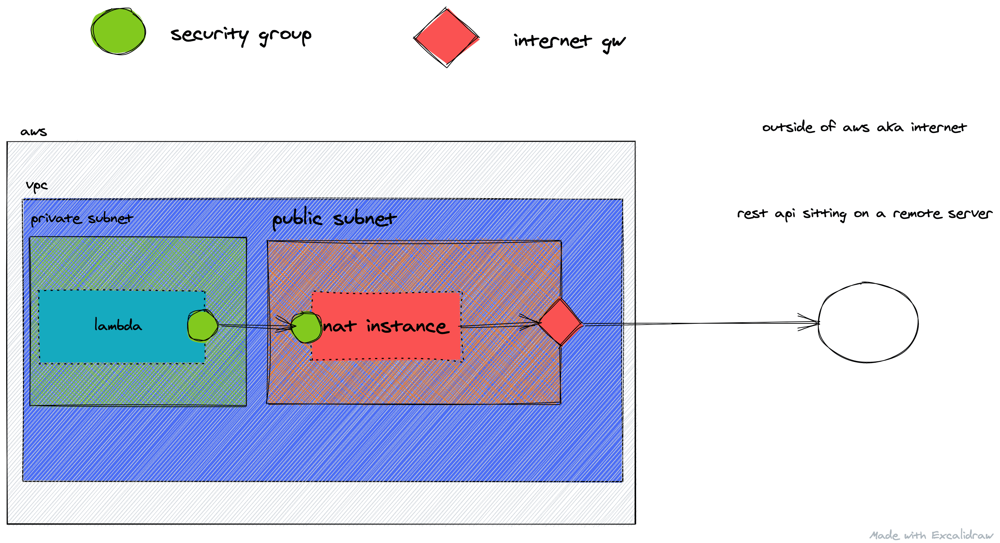

# NAT with Serverless

In a [previous guide](/guides/nat-instance), we looked at how to manually create a NAT instance on AWS to allow outgoing traffic from a resource that sits inside a private subnet.

In this guide we’ll automate the process with the help of Serverless. The resources and the code outlined in this guide can be found [here](https://github.com/tambium/saruni-samples/tree/master/guides/nat-serverless).

## Practical example

We’ll start by building a Serverless stack that prevents an outgoing request before fixing it by adding a NAT instance.

### Creating our Lambda function

The Lambda function is the same as we used in the previous guide, simply reaching out to the internet to see if our setup is working.

```js
var fetch = require("isomorphic-unfetch");

exports.handler = async () => {
  var response = await fetch("https://jsonplaceholder.typicode.com/todos/1");

  var json = await response.json();

  return {
    statusCode: 200,
    body: JSON.stringify(json),
  };
};
```

### Adding serverless.yml

The first step in moving to Serverless is to add a basic setup through the `.yml` file.

The service name is arbitrary, but will be the name of the stack created for us in AWS CloudFormation. In the `provider` section, we select AWS and provide a region and stage name. The memory size, role and runtime options relate to the Lambda itself.

`LambdaRole` comes from our `resource` directory and is an AWS role that will be assigned to the Lambda so it can access logs and EC2 instances. Finally, we define our only function that will call the JSONPlaceholder API.

```yml
service: nat-sls

provider:
  name: aws
  region: eu-west-1
  stage: dev
  memorySize: 256
  runtime: nodejs12.x
  role: LambdaRole

resources:
  Resources:
    LambdaRole: ${file(./resource/LambdaRole.yml)}

functions:
  nat:
    handler: src/index.handler
    events:
      - http:
          path: /nat
          method: get
          cors: true
```

Let’s take a look at the `LambdaRole`. This is two separate inline policies grouped together: `log` and `ec2`. The first allows the function to write to CloudWatch and the second allows communication with EC2 instance.

```yml
Type: AWS::IAM::Role
Properties:
  AssumeRolePolicyDocument:
    Statement:
      - Effect: Allow
        Action: sts:AssumeRole
        Principal:
          Service: lambda.amazonaws.com
    Version: "2012-10-17"
  Policies:
    - PolicyName: log
      PolicyDocument:
        Version: "2012-10-17"
        Statement:
          - Effect: Allow
            Action:
              - logs:CreateLogStream
              - logs:CreateLogGroup
              - logs:PutLogEvents
            Resource: arn:aws:logs:*:*:*
    - PolicyName: ec2
      PolicyDocument:
        Version: "2012-10-17"
        Statement:
          - Effect: Allow
            Action:
              - ec2:CreateNetworkInterface
              - ec2:DescribeNetworkInterfaces
              - ec2:DeleteNetworkInterface
            Resource: "*"
```

### VPC and subnets

Our goal is to create all the required resources: VPC, Internet Gateway and private and public subnets. Our Lambda function will then sit in the private subnet, with the Internet Gateway and NAT sat in the public subnets.

This requires a fair deal of Serverless boilerplate:

- A VPC defined in `ServerlessVPC.yml`
- An Internet Gateway defined in `ServerlessInternetGateway.yml` attached to the VPC through `ServerlessVPCGA.yml`.
- Three private subnets described in `ServerlessSubnet*.yml` and one public subnet in `PublicSubnet .yml`.

The public subnet is different because in the route table (`OutgoingRouteRable.yml`) they are associated with (`PublicSubnetAssociation.yml`) they point to the Internet Gateway (`Outgoing Route.yml`).

### Lambda inside our VPC

The important part is putting our Lambda function inside our VPC. For that we need the security group and three subnets.

```yml
functions:
  nat:
    vpc:
      securityGroupIds:
        - !GetAtt LambdaSecurityGroup.GroupId
      subnetIds:
        - Ref: ServerlessSubnetA
        - Ref: ServerlessSubnetB
        - Ref: ServerlessSubnetC
    handler: src/index.handler
    events:
      - http:
          path: /nat
          method: get
          cors: true
```

With this configuration our function throws an internal server error on calling, which is expected.

### Reaching the internet

We are ready to create the resources that will allow our Lambda to reach out to the internet, even inside a VPC.

### NAT instance

First, we create a private key through the AWS CLI so we can `ssh` into our EC2 VM later. To do so, we run the following command:

```sh
aws ec2 create-key-pair --key-name bastion-key
```

Next, we create our EC2 instance as a Serverless CloudFormation template file.

The `ImageId` attribute specifies which blueprint to use for the EC2 instance. We can check these [here](https://docs.aws.amazon.com/AWSCloudFormation/latest/UserGuide/walkthrough-custom-resources-lambda-lookup-amiids.html). We stick with a `micro` instance type for cost savings, but we can increase the size of the instance for improved performance later. `KeyName` should match the key name created via the CLI above.

This instance will have its own dedicated security group called `NatInstanceSG`, allowing traffic (all ports all protocols) from the Lambda function. `SubnetId` describes where to place the EC2 instance. Since our NAT instance will communicate with the outside world it needs to be in the public subnet. Finally, AWS blocks traffic that does not come from the the EC2 VM itself by default, but our traffic will originate from a Lambda function so we disable `SourceDestCheck`.

```yml
Type: AWS::EC2::Instance
Properties:
  ImageId: ami-06ce3edf0cff21f07
  InstanceType: t2.micro
  KeyName: bastion-key
  SecurityGroupIds:
    - !GetAtt NatInstanceSG.GroupId
  SubnetId: !Ref PublicSubnet
  SourceDestCheck: false
```

### NAT instance security group

The security group attached to our VM is an important piece of the puzzle, so let’s examine that.

The security group has two jobs: first it will allow all traffic (all protocol and all ports) from the Lambda (by specifying the `SourceSecurityGroupId` of the security group that will be attached to our Lambda function). Second, it will allow port 22 (`ssh`). We will need to `ssh` into our machine to change some configuration to enable NAT translation.

```yml
DependsOn: ServerlessVPC
Type: AWS::EC2::SecurityGroup
Properties:
  GroupDescription: nat
  VpcId:
    Ref: ServerlessVPC
  SecurityGroupIngress:
    - IpProtocol: -1
      FromPort: -1
      ToPort: -1
      SourceSecurityGroupId: !GetAtt LambdaSecurityGroup.GroupId
    - IpProtocol: tcp
      FromPort: "22"
      ToPort: "22"
      CidrIp: 0.0.0.0/0

  Tags:
    - Key: "Name"
      Value: "nat SSH"
```

### SSH into our VM

Next, we need to access our VM. First, we change the access permissions on the key file by running the following command from the directory where we saved our `.pem`.

```sh
chmod 600 bastion-key.pem
```

Next we head to our AWS console or EC2 dashboard and find and then copy the IP address of our NAT VM. With that information, we can `ssh` into our machine from the terminal with the following command:

```sh
ssh -i PRIVATE_KEY_NAME.pem ec2-user@IP_ADDRESS
```

Once inside, we run the following commands:

```sh
sudo sysctl -w net.ipv4.ip_forward=1
sudo /sbin/iptables -t nat -A POSTROUTING -o eth0 -j MASQUERADE
```

### Route private traffic to the NAT instance

The final step involves routing. We modified the routing table of the public subnet before. It was called `OutgoingRouteTable.yml`. It routed all unmatched traffic to the internet gateway. This time, we need to associate the NAT instance as the target for every outgoing traffic from the private subnets.

As illustrated below, unmatched traffic will go from the private subnet to the NAT instance, and unmatched traffic from the public subnet will go to the Internet Gateway.



The way to achieve this is to create a route table. Here we match every destination that did not match anything else with our `NatInstance`. In other words, if nothing else is specified, just forward it to the EC2 instance.

```yml
Type: AWS::EC2::Route
Properties:
  DestinationCidrBlock: 0.0.0.0/0
  InstanceId:
    Ref: NatInstance
  RouteTableId:
    Ref: PrivateRouteTable
```

Then we just associate it with the subnets. Not just with `ServerlessSubnetA` but with `ServerlessSubnetB` and `ServerlessSubnetC`.

```yml
Type: AWS::EC2::SubnetRouteTableAssociation
Properties:
  RouteTableId:
    Ref: PrivateRouteTable
  SubnetId:
    Ref: ServerlessSubnetA
```

## Conclusion

We ended up with the same setup as we did in the manual guide, but now Serverless handles our resources. There are still bits we need to take care of, like creating a private key and using `ssh` to access and configure our VM. Apart from this, we can now enjoy the declarative nature of Serverless and CloudFormation.
