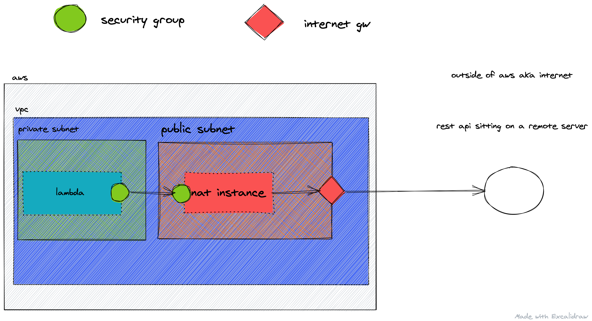

# NAT with Serverless

We [already looked](/guides/nat-instance) at how to create a NAT instance (not gateway) with AWS.

As a reminder. NAT instance, (and gateway as of that matter) server one purpose: to allow outgoing traffic from something that sits inside a private subnet.

We made that happen by manually creating the resources. In this article we are going through the step again, but with the help of Serverless.

All the resources and the whole repo can be found [here](https://github.com/tambium/GUIDE_RESOURCE_nat-sls).

# Make the setup fail

In this article we are not going to focus on the details. We did taht already in the previous one. We jump straight into the problem: we build a Serverless stack that **prevents** an outgoing request, then we will fix it by adding a NAT instance.

## Create the lambda function

The lambda function is a very simple one. The same as we used in the previous article. All we need is to reach out to the internet to see if our setup is working.

```js
var fetch = require("isomorphic-unfetch");

exports.handler = async () => {
  var r = await fetch("https://jsonplaceholder.typicode.com/todos/1");

  var j = await r.json();

  return {
    statusCode: 200,
    body: JSON.stringify(j),
  };
};
```

## Add serverless.yml

The first thing is to add the basic Serverless setup. Just a quick walkthrough what is happening here.

```yml
service: nat-sls

provider:
  name: aws
  region: eu-west-1
  stage: dev
  memorySize: 256
  runtime: nodejs12.x
  role: LambdaRole

resources:
  Resources:
    LambdaRole: ${file(./resource/LambdaRole.yml)}

functions:
  nat:
    handler: src/index.handler
    events:
      - http:
          path: /nat
          method: get
          cors: true
```

The service name is just a meta. This will be the name of stack created for us in AWS CloudFormation.

In the provider section we set up AWS as our provider with the region and stage. Memory size, role and runtime is for the lambda config.

LambdaRole is coming from the resources part. We import it from a different file (more on that later). `LambdaRole` is an AWS role that will be given to the lambda, so it can access logs and ec2 instances.

In the function section we define our only function that will get the todo api.

Lets have a look at the `LambdaRole`.

```yml
Type: AWS::IAM::Role
Properties:
  AssumeRolePolicyDocument:
    Statement:
      - Effect: Allow
        Action: sts:AssumeRole
        Principal:
          Service: lambda.amazonaws.com
    Version: "2012-10-17"
  Policies:
    - PolicyName: log
      PolicyDocument:
        Version: "2012-10-17"
        Statement:
          - Effect: Allow
            Action:
              - logs:CreateLogStream
              - logs:CreateLogGroup
              - logs:PutLogEvents
            Resource: arn:aws:logs:*:*:*
    - PolicyName: ec2
      PolicyDocument:
        Version: "2012-10-17"
        Statement:
          - Effect: Allow
            Action:
              - ec2:CreateNetworkInterface
              - ec2:DescribeNetworkInterfaces
              - ec2:DeleteNetworkInterface
            Resource: "*"
```

This is just two separate inline policies grouped together: log and ec2. Log allows the function to write to CloudWatch and ec2 to communicate to ec2 instance, as we will need this later.

## Vpc and Subnets

We will create all the required resources: vpc, internet gateway, private and public subnets. The lambda function will sit in the private subnet, the internet gateway and NAT will sit in the public subnets.

This requires quite a lot setup in terms of serverless boileraplate.

All the resources we created responsible to allow internet traffic.

We created a VPC (`ServerlessVPC.yml`) and an Internet Gateway (`ServerlessInternetGateway.yml`) and attached it to the VPC (`ServerlessVPCGA.yml`).

We created three private subnets (`ServerlessSubnet*.yml`) and one public one (`PublicSubnet
.yml`).

Public subnet is different because in the route table (`OutgoingRouteRable.yml`) they are associated with (`PublicSubnetAssociation.yml`) they point to the Internet Gateway (`Outgoing Route.yml`).

## Put the lambda inside the vpc

Let's get to the important point. Put the lambda inside a vpc. We need the security group and three subnets.

```yml
functions:
  nat:
    vpc:
      securityGroupIds:
        - !GetAtt LambdaSecurityGroup.GroupId
      subnetIds:
        - Ref: ServerlessSubnetA
        - Ref: ServerlessSubnetB
        - Ref: ServerlessSubnetC
    handler: src/index.handler
    events:
      - http:
          path: /nat
          method: get
          cors: true
```

With the help of the security group and the subnets we can put the lambda inside a vpc. As we did that, we can see our function throws an internal server error on calling, which is expected.

# Fix

We are at a point where our lambda can't reach out to the internet. So the second part of this article will deal with creating all the resources so our lambda can reach out to the internet again even inside a vpc.

## NAT instance

Time to get to the core of the idea. The very first thing we need to do is to create a private key, so later we can `ssh` into our EC2 VM. To have that ready we need to run the following command.

```sh
aws ec2 create-key-pair --key-name bastion-key
```

Next step is to create the instance as a Serverless/CloudFormation template file.

```yml
Type: AWS::EC2::Instance
Properties:
  ImageId: ami-06ce3edf0cff21f07
  InstanceType: t2.micro
  KeyName: bastion-key
  SecurityGroupIds:
    - !GetAtt NatInstanceSG.GroupId
  SubnetId: !Ref PublicSubnet
  SourceDestCheck: false
```

The `ImageId` specifies what the blueprint for the ec2 instance should be used. We can check these [here](https://docs.aws.amazon.com/AWSCloudFormation/latest/UserGuide/walkthrough-custom-resources-lambda-lookup-amiids.html).

`InstancType` is micro. Keep cost low. As we increase this we can have better performance.

`KeyName` should be the one you created with the above command.

It will have its own dedicated security group. If you remember from the previous article, that security group called `NatInstanceSG` allows traffic (all ports all protocols) from the lambda function. Will have a look at that just in a minute.

`SubnetId` is just where to put it. Since NAT will communicate with the outside world it needs to be inthe public space.

`SourceDestheck`. AWS blocks traffic that does not come from the the EC2 VM itself. Our traffic will originate from a lambda function so it must be disabled.

## NatInstanceSG

The security group attached to our VM is an important piece of the puzzle so let's examine that.

```yml
DependsOn: ServerlessVPC
Type: AWS::EC2::SecurityGroup
Properties:
  GroupDescription: nat
  VpcId:
    Ref: ServerlessVPC
  SecurityGroupIngress:
    - IpProtocol: -1
      FromPort: -1
      ToPort: -1
      SourceSecurityGroupId: !GetAtt LambdaSecurityGroup.GroupId
    - IpProtocol: tcp
      FromPort: "22"
      ToPort: "22"
      CidrIp: 0.0.0.0/0

  Tags:
    - Key: "Name"
      Value: "nat SSH"
```

The security group attached to the NAT instance will do two separate things.

First it will allow all traffic (all protocol and all ports) from the lambda (by specifing the `SourceSecurityGroupId` of the security group that will be attached to our lambda function) .

Second it will allow port 22 (ssh). We will need to `ssh` into our machine to change some config to enable NAT transalation.

## SSH into our VM

After we are done, we need to get into our VM. First `chmod` the file by running this command from the directory where you saved your `.pem`.

```sh
chmod 600 bastion-key.pem
```

Then go to your AWS console / EC2 dashboard and find the ip address of your NAT VM. Copy that.

With that info we can ssh into it from the terminal like this:

```sh
# ssh -i private_key_name.pem ec2-user@ip_address
ssh -i bastion-key.pem ec2-user@54.229.203.67
```

When inside, we need to run the following commands. Just like we did in the previous article.

```sh
sudo sysctl -w net.ipv4.ip_forward=1

sudo /sbin/iptables -t nat -A POSTROUTING -o eth0 -j MASQUERADE
```

## Route private traffic to the NAT instance

the last step involves some routing, again. We modified the routing table of the public subnet before. It was called `OutgoingRouteTable.yml`. It routed all unmatched traffic to the internet gateway.  This time we need to associate the nat gateway as the target for every outgoing traffic from the private subnets.



This picture might help a but. So (unmatched) traffic will go from the private subnet to the NAT instance, and unmatched traffic from the public one go to the Internet Gateway.

The way to do that is to create a route table with a route like this.

```yml
Type: AWS::EC2::Route
Properties:
  DestinationCidrBlock: 0.0.0.0/0
  InstanceId:
    Ref: NatInstance
  RouteTableId:
    Ref: PrivateRouteTable
```

Here we match every destintion that did not match anythign else with our natinatnace. In other words: If there is nothing else specified, just forward it to the ec2 instnace.


```yml
Type: AWS::EC2::SubnetRouteTableAssociation
Properties:
  RouteTableId:
    Ref: PrivateRouteTable
  SubnetId:
    Ref: ServerlessSubnetA
```

Then we just assoicate it with the subnets. Not just with `ServerlessSubnetA` but with `ServerlessSubnetB` and `ServerlessSubnetC`.

# Sum

So we ended up with the same setup as we did in the other article. But now Serverless handles our resources. There are still bits we need to take of, like creating a private key and sshing into our VM. Apart from these, we can now enjoy the declarative nature of Serverless / CloudFormation.